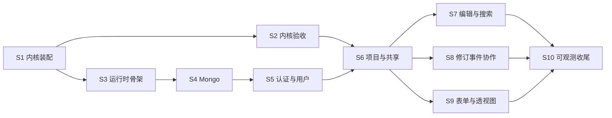

# 07 · 后端移植工作项清单

> 依据 [`01-后端架构与移植清单.md`](01-后端架构与移植清单.md) 逐节拆出的工作项，并对照代码核对完成状态；任务号对应 [`05-任务拆分与验收.md`](05-任务拆分与验收.md)。
> 核对时间：2026-10-07；分支 `backend-framework-build`，最新提交 `9ddace4`。
> 2026-10-07 第三轮：原 🟢 项已在 `716d1b1`、`c1dfbe5`、`110971d`、`075ac8b` 中提交，统一改记 ✅；全部未完成项已划分为实施阶段 S1–S10（见"实施阶段划分"），各表"阶段"列即对应标识，已完成项记"—"。
> 2026-10-08 第四轮：完成 S1（内核装配）和 S2（内核验收与 P0 收尾）的全部工作项，`mvnw -Plegacy-compat verify` 全绿。改动已在 `76f27a8`、`506ea8d`、`40d58d2`、`40e889f` 中提交，相关项记 ✅。详见文末"处理记录（第四轮）"。

## 图例与汇总

| 状态 | 含义 | 数量 |
|---|---|---|
| ✅ | 已完成，已提交 | 43 |
| 🟢 | 代码已写完，但未提交（只在工作区） | 0 |
| 🟡 | 部分完成 | 1 |
| ⬜ | 未开始 | 39 |
| | **合计** | **83** |

> 第四轮完成并提交的 4 项是 2-1、2-2、2-4（S1）和 3.3-13（S2），已计入 ✅；S2 的其余工作是附表中 P0 任务的验收测试，不计入上表。

> 2026-10-07 第二轮：处理了原先 6 个 🟡 项，其中 5 项改为 🟢；7-1 只剩 Mongo 健康检查，要等 Mongo 接入（5.3 / P1-02）。详见文末"处理记录"。

总的情况：
- §3 内核的代码已写完并提交（主要在 `110971d`）。
- 内核装配层（`ProjectContext`、`ProjectContextFactory`、`ProjectIndexes`）已在 S1 完成；提供共享线程池的 `KernelExecutors` bean 属于 `wp-app`，在 S3。
- P0 的验收测试和退出标准已在 S2 完成：新旧内核对比放在新模块 `wp-legacy-compat`（只在 `-Plegacy-compat` 下构建），性能基线见 [`perf/P0-baseline.md`](perf/P0-baseline.md)。
- §5–§8（`wp-app`、`wp-api`、`wp-cli`）都没开始，这几个模块目前只有占位类。

## 实施阶段划分

未完成的 44 项（1 个 🟡、43 个 ⬜），加上附表里 P0 任务尚缺的验收测试，按业务关联和依赖顺序分为 10 个阶段。划分原则：

- 同一阶段的工作项属于同一业务域，共用同一批数据或组件。例如事件广播、webhook、邮件都由项目事件驱动，所以放在同一阶段。
- 一个阶段只依赖排在它前面的阶段，完成后能用一组测试单独验收。
- 阶段标识用 `S`（Stage），以区别于 05 文档的里程碑 P0–P4；"对应 05 任务"一列给出两者的对应关系。

### 阶段总览

| 阶段 | 主题 | 包含工作项 | 前置阶段 | 对应 05 任务 | 状态 |
|---|---|---|---|---|---|
| S1 | 内核装配 | 2-1、2-2、2-4；P0-08 验收 | — | P0-04 剩余部分、P0-08 | ✅ 已完成 |
| S2 | 内核验收与 P0 收尾 | 3.3-13；P0-03、P0-05、P0-06、P0-07、P0-09、P0-10 验收；P0 退出标准 | S1 | P0-03、P0-05~P0-07、P0-09、P0-10 | ✅ 已完成 |
| S3 | 应用运行时骨架 | 2-3、3.4-2、7-4 | S1 | P1-01 | ⬜ |
| S4 | Mongo 持久化与迁移 | 5.3-1、5.3-2、5.3-3、7-1、8-5 | S3 | P1-02 | ⬜ |
| S5 | 认证与用户管理 | 6-1~6-6、5.1-15、5.1-16、8-1、8-2 | S4 | P1-03、P1-14（部分） | ⬜ |
| S6 | 项目管理与共享 | 5.1-10、5.1-12、5.1-13、8-3、8-4 | S2、S5 | P1-04、P1-14（部分） | ⬜ |
| S7 | 本体编辑与搜索 | 5.1-1~5.1-5、5.1-14 | S6 | P1-05、P1-06 | ⬜ |
| S8 | 修订、事件与协作通知 | 5.1-7、5.1-8、5.1-11、5.2-1、5.5-1、5.5-2 | S6 | P1-08、P1-09、P1-10 | ⬜ |
| S9 | 表单与透视图 | 5.1-6、5.1-9 | S6 | P1-07、P1-11 | ⬜ |
| S10 | 可观测与运维收尾 | 7-2、7-3、8-6 | S3–S9 | P1 退出前 | ⬜ |

S1 之后分两条线：S2（内核验收）与 S3 → S4 → S5（应用基础）可以并行，在 S6 合流。S7、S8、S9 互不依赖，可以并行或按任意顺序做。

### S1 内核装配（P0-08 收尾）

- **工作项**：按依赖顺序实现 2-4 `ProjectIndexes` → 2-2 `ProjectContextFactory` → 2-1 `ProjectContext`。
- **为什么放在一起**：三者共同构成"每个项目一张对象图"。`ProjectContextFactory` 要靠 `ProjectIndexes` 建索引，`ProjectContext` 是它的产物；项目读写锁（3.4-1 已验证）此时改由 `ProjectContext` 持有。线程池作为构造参数传入，提供线程池的 `KernelExecutors` bean 放到 S3。
- **完成标志**：`ChangeManagerIT` 通过，覆盖"创建类 → 索引可见 → 修订追加 → 事件桶里有 `ClassFrameChanged` 和 `EntityHierarchyChanged` → Lucene 可搜"；`ProjectContext.close()` 释放本项目的资源，但不关闭传入的线程池。
- **完成情况（第四轮，✅ `76f27a8`）**：已达到完成标志。`ProjectIndexesTest` 6 个、`ChangeManagerIT` 2 个、`ProjectContextFactoryIT` 6 个用例通过；变异检查：去掉 Lucene 全量建索引后 `shouldRebuildMissingLuceneIndexWhenLoading` 失败。

### S2 内核验收与 P0 收尾

- **工作项**：3.3-13 `kernel.io.merge` 原样移植；附表中 P0-03、P0-05、P0-06、P0-07、P0-09、P0-10 尚缺的验收测试；P0 退出标准（性能基线、CI）；修正 01 和 05 文档里的两处描述（实体 JSON 格式见 4-6，`amino-acid-form.json` 见附表 P0-10）。
- **为什么放在一起**：都是验证已完成的内核与旧系统行为一致，共用同一批测试数据。merge 与上传、下载同属 `kernel.io`，和 P0-09 的往返测试一起做。
- **先准备测试数据**：pizza.owl；旧 BinaryOWL 样本或一个真实项目目录；一份按当前 `FormDescriptor` 格式导出的表单 JSON。P0-05 还要把旧 `webprotege-server-core` jar 作为测试依赖引入。
- **完成标志**：达到 05 文档的 P0 退出标准：上述验收测试在 CI 中通过；`docs/perf/P0-baseline.md` 记录加载 50k 公理项目的耗时，且不超过旧系统的 1.2 倍。
- **完成情况（第四轮，✅ `506ea8d`、`40d58d2`、`40e889f`）**：验收测试全部通过，性能比值 1.01；新旧对比测试放在新模块 `wp-legacy-compat`，CI 新增 `legacy-compat` 作业（本地按其步骤模拟通过，远端首次运行要等推送后确认）。数据上的两处变通：仓库里没有原版 pizza.owl，改用自写的同结构测试本体；没有真实项目目录，改用"pizza 导入 + 300 条确定性编辑"的历史代替，并保留 `-Dwp.compat.projectDirectory` 参数供拿到真实项目时直接对比。

### S3 应用运行时骨架（P1-01）

- **工作项**：3.4-2 `KernelExecutors` → 2-3 `ProjectRegistry` → 7-4 优雅停机。
- **为什么放在一起**：三者都管项目在进程里的生命周期。`KernelExecutors` 提供共享线程池；`ProjectRegistry` 用这些线程池和 S1 的 `ProjectContextFactory` 按需加载项目，空闲过期时关闭；停机时 `closeAll()` 等待修订写盘完成。`ProjectRegistry` 同时接上已有的 `DataDirectoryLayout` bean（5.4-1）。
- **完成标志**：驱逐测试中，项目空闲 1 秒后 `ProjectContext.close()` 被调用；同一项目被并发加载时只构造一次；停机时尚未完成的修订全部落盘。

### S4 Mongo 持久化与迁移（P1-02）

- **工作项**：5.3-1 19 个集合的 `*Document` 和仓库；5.3-2 不写 `_class`；5.3-3 `OwlEntityMongoCodec`；8-5 `migrate-mongo`；7-1 剩下的 Mongo 健康检查。
- **为什么放在一起**：都是为了与旧 Mongo 数据兼容。仓库实现 `kernel-api` `port` 包里已有的接口。8-5 是迁移入口，顺带搭好 `wp-cli` 的 picocli 骨架，供 S5、S6、S10 的命令复用；7-1 在引入 Mongo starter 后由 Spring Boot 自动提供。
- **注意**：验收要用 Testcontainers，本机目前没有 Docker，需要在 CI 或装有 Docker 的机器上运行。
- **完成标志**：导入旧 `mongoexport` 样本后，每个仓库都能读出正确的对象；写回后与原文档相比只少了 `className`；`/actuator/health` 包含 `mongo` 且为 UP。

### S5 认证与用户管理（P1-03、P1-14 部分）

- **工作项**：6-1~6-6（JWT、管理员角色映射、API Key、本地兜底登录、无状态认证、兼容层安全链）；5.1-15 `UserService` 和 `ApplicationSettingsService`；5.1-16 `accessManager.require()` 与 403；8-1 `create-admin`；8-2 `generate-api-key`。
- **为什么放在一起**：都回答"调用者是谁、有哪些应用级权限"。首次登录要通过 `UserService` 写入 `Users`；API Key 过滤器查询 `UserApiKeys`；`create-admin` 和 `generate-api-key` 用来创建首个管理员和 API Key。5.1-16 在这一阶段建立机制，之后各阶段新写的服务都要遵守。
- **完成标志**：Keycloak Testcontainer 下，有 JWT、有 API Key、无凭证三种请求分别得到正确的用户或 401；缺少权限的服务调用抛出 `PermissionDeniedException` 并返回 403；`create-admin` 之后该用户的应用权限包含 `EDIT_APPLICATION_SETTINGS`；`generate-api-key` 生成的 Key 能通过认证；旧 `AccessManagerImpl_TestCase` 转换后通过。

### S6 项目管理与共享（P1-04、P1-14 部分）

- **工作项**：5.1-13 `ProjectService`；5.1-12 `ProjectSettingsService`；5.1-10 `SharingService` 和 `PermissionService`；8-3 `rebuild-permissions`；8-4 `set-permissions`。
- **为什么放在一起**：都以项目为单位：创建（空项目或上传导入）、列表、设置、回收站，以及谁能访问这个项目。两条 CLI 命令直接操作项目的角色分配。上传导入依赖 S2 的 P0-09 验收，权限检查依赖 S5。
- **完成标志**：创建（空项目 / 上传）→ 三种过滤条件的列表 → 设置读写 → 分享给其他用户 → 移入回收站再恢复，整个流程跑通；`set-permissions` 之后该用户的项目权限立即生效。

### S7 本体编辑与搜索（P1-05、P1-06）

- **工作项**：5.1-1 帧、Manchester、本体服务；5.1-2 实体与渲染；5.1-3 层级与批量编辑；5.1-4 个体；5.1-14 公理；5.1-5 搜索与搜索设置。
- **为什么放在一起**：都是对单个项目本体的读写，直接调用 `ProjectContext` 里的内核组件；搜索还为编辑提供实体补全。
- **完成标志**：创建类（指定父类）→ 层级中出现该子类 → 在帧上加注解 → 并发修改时返回 409 → Manchester 校验报出错误的行列 → 合并实体 → 删除，整个流程跑通；在 pizza 项目中搜索 "mozz" 命中 `MozzarellaTopping`。

### S8 修订、事件与协作通知（P1-08、P1-09、P1-10）

- **工作项**：5.1-7 `RevisionService`；5.1-8 `ProjectEventService`；5.2-1 `ProjectEventBroadcaster`；5.5-2 webhook 调用；5.5-1 `MailSender`；5.1-11 标签、关注、讨论服务。
- **为什么放在一起**：都消费 `ChangeManager` 产生的修订和事件。广播器把事件推给 SSE，同时触发 webhook 和邮件；邮件的两个模板正好是评论通知和关注通知。
- **完成标志**：回滚修订后帧恢复原状；按实体查询变更时只返回该实体的变更；A 创建类后，B 的订阅在 1 秒内收到事件，按 `since` 补发时不丢不重；评论里 `@user` 和关注实体的变更都会触发邮件（用 GreenMail 验证）；webhook 收到 `{projectId, userId, revisionNumber, timestamp}`。

### S9 表单与透视图（P1-07、P1-11）

- **工作项**：5.1-6 表单描述符与表单数据服务；5.1-9 透视图服务。
- **为什么放在一起**：两者都是按项目保存、供前端渲染的界面配置（对应 `Forms`/`FormSelectors` 和 `PerspectiveDescriptors`/`PerspectiveLayouts` 集合），也是前端 P2-03、P2-12 的前置。表单数据读写依赖 S2 中 P0-10 的表单端到端验收。
- **完成标志**：导入当前格式的表单 JSON → 读取实体的表单数据 → 修改一个字段 → 产生修订；把表单复制到另一个项目；新用户第一次获取透视图时得到 8 个内置标签页，写入的布局 JSON 读出后字节级一致，重置后恢复内置布局。

### S10 可观测与运维收尾（P1 退出前）

- **工作项**：7-2 6 个自定义指标；7-3 日志 MDC；8-6 `reindex-lucene`。
- **为什么放在一起**：都是横跨多个阶段的运维能力，要等被观测的组件都就位后再统一接入：项目加载指标依赖 S3，变更和搜索指标依赖 S7，SSE 连接数依赖 S8，MDC 里的 `userId` 依赖 S5。
- **完成标志**：6 个指标出现在 `/actuator/prometheus` 中；日志行带有 `projectId`、`userId`、`traceId`；`reindex-lucene` 重建索引后，搜索结果与重建前一致。

> 本清单只覆盖 01 文档。02 文档的 REST 端点、`/data/*` 兼容层（P1-13）、`wp-integration`（P1-12）和 OpenAPI（P1-15）不在本清单内，建议在 S6–S9 实现对应服务时一并补上相应端点。

## 构建与测试结果

第四轮（S1、S2）完成后，对全部 12 个模块运行 `mvnw -Plegacy-compat verify`（包含 spotless 和 checkstyle），结果 **BUILD SUCCESS**，checkstyle 0 违规：

| 模块 | 单元测试 | 集成测试 |
|---|---|---|
| `wp-domain` | 1072 个全部通过 | 5 个全部通过 |
| `wp-kernel-api` | 169 个全部通过 | — |
| `wp-kernel` | 1004 个全部通过（第三轮 968，新增 `kernel.io.merge` 30 个、`ProjectIndexesTest` 6 个） | 47 个全部通过（第三轮 23，新增 24 个，见"处理记录（第四轮）"） |
| `wp-server` | 5 个全部通过 | — |
| `wp-legacy-compat`（仅 `-Plegacy-compat`） | — | 11 个：9 个通过，2 个跳过（需要 `-Dwp.compat.projectDirectory` 指定真实项目） |

不带 profile 的 `mvnw verify`（即现有 `backend` CI 作业）不构建 `wp-legacy-compat`，不需要旧系统 jar。CI 新增的 `legacy-compat` 作业的步骤（安装内核 → 单独构建 `wp-legacy-compat`）已在本地模拟通过。

第一轮核对时，`wp-kernel` 的 `FormDescriptor_Serialization_IT` 有 2 个失败，第二轮已修复（见"处理记录"）。

---

## §1 分层职责

| # | 工作项 | 状态 | 阶段 | 依据 / 说明 |
|---|---|---|---|---|
| 1-1 | 10 个模块的骨架；构建检查规则限制模块分层，并保证 domain、kernel-api、kernel 不依赖 Spring | ✅ | — | 提交 `865581c`（P0-01） |

## §2 项目级对象图：`ProjectContext`

| # | 工作项 | 状态 | 阶段 | 依据 / 说明 |
|---|---|---|---|---|
| 2-1 | `ProjectContext`：持有索引、修订、层级、字典、渲染、CRUD、事件、`ChangeManager` 和读写锁，提供 `close()` | ✅ | S1 | 提交 `76f27a8`。新增 `kernel.project.ProjectContext`，另持有 `LanguageManager`、Lucene 索引写入器（供以后的 `reindex-lucene`）、`DeprecatedEntityChecker`、`EntityNodeRenderer`、`MatchingEngine`、`MatcherFactory`、`DefaultOntologyIdManager`；四个层级放在新 record `HierarchyProviders`。`close()` 幂等，先取写锁等待读写结束，再按打开的逆序释放（事件清理任务 → Lucene searcher → writer → directory → 等待修订写盘），不关闭共享线程池。`ProjectContextFactoryIT` 验证：关闭后线程池仍在运行、Lucene 写锁已释放（可再次打开）、`ChangeManager` 在该锁下写入（持有读锁时写入排队） |
| 2-2 | `ProjectContextFactory.create()`：按旧 `ProjectModule` 的顺序构造（目录 → 加载修订 → 索引 → 建索引 → 层级 → Lucene → `ChangeManager`） | ✅ | S1 | 提交 `76f27a8`。新增 `kernel.project.ProjectContextFactory`，手写替代旧 `ProjectModule`、`IndexModule`、`ShortFormModule`、`LuceneModule` 的 provider；应用层协作者通过新接口 `ProjectPorts` 注入，共享线程池通过 record `KernelThreadPools` 注入，事件保留期可配置。旧代码里经 `Provider` 每次新建的对象照旧每次新建：事件翻译器（持有一次变更的前后状态）和 Lucene 文档翻译器（读取当前搜索过滤器）。构造失败时释放已打开的资源。`ProjectContextFactoryIT` 验证：空项目可打开；关闭后重新打开能看到修订、层级和 Lucene 索引；Lucene 索引目录被删除后重新全量构建；同一项目重复打开失败后不泄漏资源 |
| 2-3 | `ProjectRegistry`（放在 `wp-app`）：用 Caffeine 实现空闲过期，过期时调用 `close()`，加载时按项目加锁 | ⬜ | S3 | `wp-app` 只有占位类（P1-01） |
| 2-4 | `ProjectIndexes`：显式创建全部索引实现并按构造器依赖连线，提供 `get(Class)` 和 `updatable()` | ✅ | S1 | 提交 `76f27a8`。新增 `kernel.index.ProjectIndexes`。每个实现按自身类和直接实现的 `kernel.api.index` 接口登记，同一接口出现两个实现时报错；`get` 不限定 `T extends Index`，因为 `RootIndex` 等 8 个接口不继承 `Index`（01 §3.2 规则 3 已同步修正）。构造分两步：`builder()` 创建全部基于公理的索引，`build(...)` 在类层级、字典、Lucene 建好后补上 `IndividualsIndex`、`IndividualsByTypeIndex` 和两个 Lucene 版 deprecated 索引（与旧绑定一致）。`ProjectIndexesTest` 6 个用例：从类路径扫描 `kernel.api.index` 的全部接口并逐个取到实现；`updatable()` 恰为 17 个主索引；每个派生索引的依赖都是已登记的同一实例 |

## §3 内核移植

### §3.1 变更模型与修订

| # | 工作项 | 状态 | 阶段 | 依据 / 说明 |
|---|---|---|---|---|
| 3.1-1 | `kernel.api.change`：`OntologyChange` 等 16 个，AutoValue 改为 record | ✅ | — | 提交 `ff39f5e` |
| 3.1-2 | `kernel.api.revision` | ✅ | — | 提交 `ff39f5e` |
| 3.1-3 | BinaryOWL 修订存储 `BinaryOwlRevisionStore`；新增 `RevisionStore` 接口（`load/append/getRevisions/getHead`）；写盘线程改为外部注入 | ✅ | — | 已改名为 `kernel.revision.BinaryOwlRevisionStore`。接口改为 `load/append/getRevisions/getRevision/getHead`，并继承 `HasDispose`。写盘线程池由 `RevisionStoreFactory` 注入：在共享线程池上，每个 store 用一条 `CompletableFuture` 链保证按修订号顺序追加；`dispose()` 只等待本 store 未完成的写盘（最长 1 分钟），不关闭共享线程池。`BinaryOwlRevisionStoreIT` 12 个用例通过，其中新增"4 线程共享池下 50 条修订按序落盘"和"`dispose` 不关闭共享池"；还修正了旧测试的一个 bug：重新加载后断言的是原 store，导致"重新加载可见"从未被真正验证 |
| 3.1-4 | `RevisionManager`、`ProjectChangesManager`、`EntitiesByRevisionCache` | ✅ | — | `kernel/revision` |
| 3.1-5 | 变更生成器全家（`HasApplyChanges`、`ChangeListGenerator`、`Create*`、`Delete*`、`Merge*`、`Move*`、`RevisionReverter*`、`FindAndReplaceIRIPrefix*` 等）和 bulkop；`@AutoFactory` 改为手写工厂 | ✅ | — | `kernel/change` 32 个文件，加 `change/bulkop` 6 个 |
| 3.1-6 | `change.description`（43 个） | ✅ | — | 43 个，数量一致 |
| 3.1-7 | `change.matcher`（21 个） | ✅ | — | 21 个，数量一致 |
| 3.1-8 | `ChangeManager`：权限检查上移到 `wp-app`；原来的 webhook 和 `setModified` 改为发布 `ProjectChangedKernelEvent` | ✅ | — | `EDIT_ONTOLOGY` 由应用服务在调用前检查；创建实体时的 `CREATE_*` 权限通过 `kernel.api.port.ChangePermissionChecker` 回调应用层；项目变更改为通知 `ProjectChangedKernelEvent` 监听器 |
| 3.1-9 | 写路径顺序保持不变（生成变更 → 铸造 fresh IRI → 计算有效变更 → 事件预处理 → 更新索引 → 活跃语言 → 字典 → 追加修订 → 4 个层级 → 释放写锁 → 高层事件 → 投递事件） | ✅ | — | [`ChangeManager.java`](../wp-kernel/src/main/java/org/industrial/ontology/kernel/change/ChangeManager.java) 第 308–463 行的顺序与文档一致 |

### §3.2 索引

| # | 工作项 | 状态 | 阶段 | 依据 / 说明 |
|---|---|---|---|---|
| 3.2-1 | 索引接口 `kernel.api.index` | ✅ | — | 提交 `ff39f5e`（65 个文件） |
| 3.2-2 | 17 个主索引（`UpdatableIndex`） | ✅ | — | 全部存在，已去掉 `Impl` 后缀 |
| 3.2-3 | 派生索引（`DependentIndex`），含 `RootIndex`、帧、属性、签名系列等 | ✅ | — | `kernel/index`；`BuiltInOwlEntitiesIndexImpl` 和 `BuiltInSkosEntitiesIndexImpl` 放在了 `kernel-api`，且保留了 `Impl` 后缀，与规则 1 略有出入 |
| 3.2-4 | Lucene 版"已废弃实体"索引（2 个） | ✅ | — | `kernel/lucene/DeprecatedEntitiesIndexLucene`、`DeprecatedEntitiesByEntityIndexLucene` |
| 3.2-5 | 索引基础设施：`UpdatableIndex`、`DependentIndex`、`AxiomMultimapIndex`、`AxiomChangeHandler`、`IndexedSet`、`IndexedSetMultimaps`、`Key`、`KeyValueExtractor`、`IndexUpdater`、`Stats` | ✅ | — | 全部存在（`DependentIndex` 在 `kernel-api`） |
| 3.2-6 | `IndexUpdater` 保留分层并行更新，线程池由外部注入 | ✅ | — | `IndexUpdaterFactory` 接收外部传入的线程池 |
| 3.2-7 | 约 60 个索引测试转 JUnit 5，类名后缀 `_TestCase` 改为 `Test` | ✅ | — | 54 个转换的测试类通过。旧仓库其实没有 05 文档提到的 `IndexUpdater_TestCase`，所以依赖图分层测试是新写的：`IndexUpdaterTest` 5 个用例，用合成依赖图（含跨层依赖、并行线程池）验证"依赖全部完成后才开始"和"上一层全部完成后才开始下一层"，并覆盖全量重放和增量更新。变异检查：把分层去掉后有 3 个用例失败，说明测试有效 |

> `ProjectIndexes` 见 2-4。

### §3.3 层级、帧、渲染、短名、CRUD 工具包

| # | 工作项 | 状态 | 阶段 | 依据 / 说明 |
|---|---|---|---|---|
| 3.3-1 | 层级：`kernel.api.hierarchy`（7 个接口）和 `kernel.hierarchy`（含 4 个层级 Provider） | ✅ | — | 接口提交于 `ff39f5e`，实现 22 个文件提交于 `110971d`；4 个 Provider 测试通过 |
| 3.3-2 | 帧：`kernel.frame` 和 `frame/translator` | ✅ | — | 15 个，加 translator 21 个 |
| 3.3-3 | Manchester 语法：渲染、解析、补全、校验 | ✅ | — | `mansyntax/render` 67 个，加 `mansyntax` 7 个 |
| 3.3-4 | 渲染：`kernel.render`、`RenderingManager` | ✅ | — | `kernel/render` |
| 3.3-5 | 短名：`DictionaryManager`、`LanguageManager`、`ActiveLanguagesManager`、`BuiltInShortFormDictionary`、`LocalNameShortFormCache`、`DictionaryUpdatesProcessor` | ✅ | — | `kernel/shortform` |
| 3.3-6 | Lucene 字典与搜索，升级到 Lucene 9 API | ✅ | — | 父 POM 用 Lucene 9.12.3，`kernel/lucene` 45 个文件；旧仓库只有 3 个 Lucene 测试，均已转换。搜索验收测试 `PizzaSearchIT` 在 S2 完成（附表 P0-07） |
| 3.3-7 | CRUD 工具包：注册表、UUID / OBO-ID / SuppliedName 三种 kit、`ProjectEntityCrudKitHandlerCache` | ✅ | — | `kernel/crud`；设置仓库接口在 `kernel-api` 的 `port` 包 |
| 3.3-8 | 实体：fresh entity IRI、`IriReplacer` | ✅ | — | `FreshEntityIri` 在 `domain.entity`，`IriReplacer` 在 `kernel.api.util`，`kernel/entity` 4 个文件 |
| 3.3-9 | 条件匹配器 `kernel.match`（约 40 个） | ✅ | — | 48 个文件 |
| 3.3-10 | 事件：`ProjectEventManager`、`EventTranslatorManager`、`HighLevelEventGenerator`、`*EventComputer/Translator`；保留期可配置，默认 10 分钟 | ✅ | — | `ProjectEventManager.DEFAULT_RETENTION` 为 10 分钟；清理任务的调度线程由外部注入 |
| 3.3-11 | 下载 `kernel.io.download`（`ProjectDownloader`、`DownloadFormat`、缓存） | ✅ | — | 7 个文件 |
| 3.3-12 | 上传导入 `kernel.io.upload`（zip 和单文件提取、`RawProjectSourcesImporter`、`ProjectImporter`、`UploadedOntologiesProcessor`） | ✅ | — | 17 个文件 |
| 3.3-13 | 合并 `kernel.io.merge`（现在原样移植，P4 再接线） | ✅ | S2 | 提交 `506ea8d`。新增 `kernel.io.merge`：`merge/` 的 6 个类（`AnnotationDiffCalculator`、`AxiomDiffCalculator`、`OntologyDiffCalculator`、`ModifiedProjectOntologiesCalculator`、`OntologyPatcher`、`ProjectOntologiesBuilder`）和 `merge_add/` 的 2 个类（`MergeOntologyCalculator`、`OntologyMergeAddPatcher`），`@AutoFactory` 改为手写 `ModifiedProjectOntologiesCalculatorFactory`；旧的 8 个测试转 JUnit 5，30 个用例通过。5 个 GWT dispatch handler 不移植（01 §4），P4 由 `wp-app` 服务代替；两个 patcher 原先只从 dispatch `ExecutionContext` 取 `UserId`，现在直接接收 `UserId`。原样保留的旧行为：`MergeOntologyCalculator` 把 `List<OWLOntologyID>` 参数强转为 `ArrayList`，P4 调用方传 `List.of`/`ImmutableList` 会抛 `ClassCastException`，接线时要处理 |
| 3.3-14 | 表单内核 `kernel.form`（含 data、processor）；`EntityFrameFormDataComponent` 子组件改为普通工厂 `EntityFrameFormDataDtoBuilderFactory` | ✅ | — | 新增 `EntityFrameFormDataDtoBuilderFactory`，删除 `EntityFrameFormDataComponent` 和 `EntityFrameFormDataModule`。每次请求的 `create()` 都新建一整张对象图，原来的 Dagger 循环依赖改由 `Supplier` 打断；只共享渲染器、`BindingValuesExtractor`、签名索引、`MatchingEngine` 和过滤匹配工厂。`EntityFrameFormDataDtoBuilderFactoryTest` 3 个用例通过（文本字段、经由循环依赖的子表单、渲染缓存只在同一请求内共享）。`FormDescriptor_Serialization_IT` 已修复，2/2 通过，原因见文末"处理记录" |
| 3.3-15 | 不移植：`obo`、`collection`、`csv`、Slack webhook | ✅ | — | 均未引入（`PrefixDeclarationsCsvParser` 是内置前缀加载用的，不算 CSV 功能） |

### §3.4 并发与锁

| # | 工作项 | 状态 | 阶段 | 依据 / 说明 |
|---|---|---|---|---|
| 3.4-1 | 每个项目一把读写锁；`applyChanges` 先取变更串行锁，再取写锁 | ✅ | — | `ChangeManagerConcurrencyIT` 2 个用例通过。① 100 个线程并发 `applyChanges`：每个生成器读取当前修订号 N 并生成 `after-N` 公理，结果 100 条修订编号连续，第 k 条恰好基于 k−1 生成，重新加载修订文件后完全一致。② 持有读锁时写入会排队等待，释放后才完成。变异检查：去掉变更串行锁后用例①失败。"锁由 `ProjectContext` 持有"已随 2-1 在 S1 实现，并由 `ProjectContextFactoryIT.shouldApplyChangesUnderTheContextLock` 验证 |
| 3.4-2 | 修订写盘、事件清理、索引更新的线程池统一由 `wp-app` 的 `KernelExecutors` bean 提供；`ProjectContext.close()` 不关闭共享线程池 | ⬜ | S3 | `KernelExecutors` 不存在；内核侧的索引更新、事件清理和修订写盘（见 3.1-3）都已改为由外部注入线程池。S1 新增的 record `kernel.project.KernelThreadPools` 是 `ProjectContextFactory` 接收这三个线程池的入口，`KernelExecutors` bean 只需构造它；"`close()` 不关闭共享线程池"已由 `ProjectContextFactoryIT` 验证 |

---

## §4 `wp-domain`

| # | 工作项 | 状态 | 阶段 | 依据 / 说明 |
|---|---|---|---|---|
| 4-1 | `domain.core`：`UserId`、`ProjectId`、`BuiltInAction`、`BuiltInRole`、`ApiKey*` 等基础类型 | ✅ | — | 提交 `4d17699` |
| 4-2 | `domain.entity`、`domain.frame`、`domain.form`、`domain.match`、`domain.lang` | ✅ | — | 提交 `4d17699` |
| 4-3 | 设置与协作类：projectsettings、crud、sharing、tag、watches、issues、perspective、change、revision、search、hierarchy、pagination、webhook（去 Slack）、app | ✅ | — | 提交 `4d17699` |
| 4-4 | 事件：去掉 GWT 父类，改为 `sealed interface ProjectEvent` 加 record；类型名为旧类名去掉 `Event` 后缀 | ✅ | — | `domain/event` 31 个文件，提交 `716d1b1`；`@JsonTypeInfo(use = NAME, property = "type")` 已覆盖 01 §5.2 列出的全部类型名 |
| 4-5 | 不移植：dispatch、place、obo（`OboId` 除外）、collection、csv、viz、auth、itemlist | ✅ | — | 均未引入 |
| 4-6 | `OwlEntityJsonTest` 固定 OWL 实体的 JSON 格式 | ✅ | — | 测试固定的是旧 `ObjectMapperProvider` 的真实输出 `{"type":"owl:Class","iri":…}`；01 §4 和 05 P0-02 原来写的 `{"@type":"Class",…}` 与之不符，已在 S2 修正。02 文档（API 契约）第 17 行仍写 `@type`，REST 返回的实体 JSON 实际会是 `type` + `owl:` 前缀，建议在 P1 定 API 契约时一并统一 |

---

## §5 `wp-app`：应用服务与持久化

### §5.1 应用服务

| # | 工作项（包 `app.<feature>`） | 状态 | 阶段 |
|---|---|---|---|
| 5.1-1 | `frame.FrameService`、`frame.ManchesterSyntaxService`、`frame.OntologyService` | ⬜ | S7 |
| 5.1-2 | `entity.EntityService`、`entity.EntityRenderingService` | ⬜ | S7 |
| 5.1-3 | `hierarchy.HierarchyService`、`entity.BulkEditService` | ⬜ | S7 |
| 5.1-4 | `entity.IndividualsService` | ⬜ | S7 |
| 5.1-5 | `search.SearchService`、`search.SearchSettingsService` | ⬜ | S7 |
| 5.1-6 | `form.FormDescriptorService`、`form.FormDataService` | ⬜ | S9 |
| 5.1-7 | `revision.RevisionService` | ⬜ | S8 |
| 5.1-8 | `event.ProjectEventService`（`since(tag)` 加订阅） | ⬜ | S8 |
| 5.1-9 | `perspective.PerspectiveService` | ⬜ | S9 |
| 5.1-10 | `access.SharingService`、`access.PermissionService` | ⬜ | S6 |
| 5.1-11 | `tag.TagService`、`watch.WatchService`、`issues.DiscussionService` | ⬜ | S8 |
| 5.1-12 | `project.ProjectSettingsService` | ⬜ | S6 |
| 5.1-13 | `project.ProjectService` | ⬜ | S6 |
| 5.1-14 | `frame.AxiomsService` | ⬜ | S7 |
| 5.1-15 | `admin.ApplicationSettingsService`、`user.UserService` | ⬜ | S5 |
| 5.1-16 | 每个服务方法入口调用 `accessManager.require(...)`，无权限抛 `PermissionDeniedException`（返回 403） | ⬜ | S5 |

### §5.2–§5.5 事件、持久化、文件系统、通知

| # | 工作项 | 状态 | 阶段 | 依据 / 说明 |
|---|---|---|---|---|
| 5.2-1 | `ProjectEventBroadcaster`：订阅各项目事件，推给 SSE 注册表，同时触发 webhook 和邮件 | ⬜ | S8 | 事件 JSON 类型名已在 4-4 完成 |
| 5.3-1 | 19 个 Mongo 集合的 `*Document` 类和仓库（Users、UserActivity、ProjectDetails、ProjectAccess、RoleAssignments、PrefixDeclarations、EntityCrudKitSettings、PerspectiveDescriptors、PerspectiveLayouts、Forms、FormSelectors、Tags、EntityTags、Watches、EntityDiscussionThreads、ProjectWebhook、UserApiKeys、ApplicationPreferences、EntitySearchFilters） | ⬜ | S4 | `kernel-api` 的 `port` 包里已有部分仓库接口（`ProjectDetailsRepository`、`EntityDiscussionThreadRepository`、`EntityFormRepository`、`EntityFormSelectorRepository`、`TagsManager`、`WatchManager`、`PrefixDeclarationsStore` 等，已提交） |
| 5.3-2 | 写入 Mongo 时不产生 `_class` 字段，并忽略旧数据里的 `className` | ⬜ | S4 | |
| 5.3-3 | `OwlEntityMongoCodec`：先用 `mongoexport` 导出旧样本放进测试资源，保证新旧文档字节级兼容 | ⬜ | S4 | |
| 5.4-1 | 数据目录布局与旧版一致（`data-store/project-data/<id>/change-data/change-data.binary`、`uploads`、`lucene-indexes`、`download-cache`、`templates`） | ✅ | — | 新增 `kernel.project.DataDirectoryLayout`，作为从数据根目录推导全部旧版路径、并提供相应路径组件的唯一入口；路径名与旧代码逐一核对过。`DataDirectoryLayoutTest` 7 个用例把整个布局固定下来。`wp-server` 新增 `DataDirectoryConfiguration`，把已有的 `webprotege.data-directory` 配置绑定为 `DataDirectoryLayout` bean，启动时创建目录。`ProjectRegistry` 使用该 bean 的部分随 2-3 在 S3 实现 |
| 5.5-1 | `MailSender`：Spring Mail 加 Mustache 模板，迁入评论通知和关注通知两个模板 | ⬜ | S8 | |
| 5.5-2 | `ProjectChangedWebhookInvoker`：载荷 `{projectId, userId, revisionNumber, timestamp}`，`@Async` 异步调用 | ⬜ | S8 | |

---

## §6 安全（`wp-api`）

| # | 工作项 | 状态 | 阶段 | 依据 / 说明 |
|---|---|---|---|---|
| 6-1 | JWT 认证：用 `preferred_username` 作为 UserId，首次见到的用户写入 `Users` | ⬜ | S5 | `wp-api` 只有占位类；`deploy/` 下已有 Keycloak realm 配置 |
| 6-2 | JWT 的管理员 realm 角色映射为 `SYSTEM_ADMIN`（不落库） | ⬜ | S5 | |
| 6-3 | `ApiKeyAuthenticationFilter`：`Authorization: ApiKey <key>` 做 SHA-256 后查 `UserApiKeys`；与 JWT 并存，JWT 优先 | ⬜ | S5 | |
| 6-4 | 本地兜底登录：开关打开时启用 `/login` 表单（BCrypt），仅供开发和首个管理员 | ⬜ | S5 | |
| 6-5 | 关闭 CSRF，认证无状态 | ⬜ | S5 | |
| 6-6 | `/download` 和 `/data/*` 兼容层走同一条 Security 链；下载链接可用 `?apiKey=`（可配置关闭） | ⬜ | S5 | |

> 服务层授权见 5.1-16。

---

## §7 可观测与运维

| # | 工作项 | 状态 | 阶段 | 依据 / 说明 |
|---|---|---|---|---|
| 7-1 | Actuator：`health`（含 Mongo、数据目录可写检查）、`metrics`、`prometheus` | 🟡 | S4 | 已开放 `health,info,metrics,prometheus`。数据目录健康检查已完成：`DataDirectoryHealthIndicator` 通过写入并删除探针文件判断可写，`DataDirectoryHealthIndicatorTest` 3 个用例通过；冒烟测试新增断言 `dataDirectory` 为 UP，并改用临时数据目录。**只剩 Mongo 健康检查**：它会在 5.3 / P1-02 引入 `spring-boot-starter-data-mongodb` 后由 Spring Boot 自动提供；现在提前引入会让没有 Mongo 的环境健康变成 DOWN，而且本机没有 Docker，无法用 Testcontainers 验证 |
| 7-2 | 6 个自定义指标：`wp.projects.loaded`、`wp.project.load.seconds`、`wp.changes.applied`、`wp.change.apply.seconds`、`wp.events.sse.connections`、`wp.search.seconds` | ⬜ | S10 | 指标的埋点位置分布在 S3（项目加载）、S7（变更、搜索）、S8（SSE 连接） |
| 7-3 | 日志 MDC：`projectId`、`userId`、`traceId` | ⬜ | S10 | |
| 7-4 | 优雅停机：`ProjectRegistry.closeAll()` 等待修订写盘完成 | ⬜ | S3 | 依赖 2-3 |

---

## §8 `wp-cli`

命令行用 Spring Boot `ApplicationRunner` 加 picocli 实现，打成独立可执行 jar，复用 `wp-app`。目前 `wp-cli` 只有占位类；picocli 骨架随 8-5 在 S4 搭建。

| # | 工作项 | 状态 | 阶段 |
|---|---|---|---|
| 8-1 | `create-admin --user --email [--password]` | ⬜ | S5 |
| 8-2 | `generate-api-key --user --purpose` | ⬜ | S5 |
| 8-3 | `rebuild-permissions` | ⬜ | S6 |
| 8-4 | `set-permissions --project --user --role` | ⬜ | S6 |
| 8-5 | `migrate-mongo`（见 5.3） | ⬜ | S4 |
| 8-6 | `reindex-lucene --project <id> \| --all` | ⬜ | S10 |

---

## 附：05 文档 P0 任务的验收状态

| 任务 | 状态 | 已有 | 还缺 | 阶段 |
|---|---|---|---|---|
| P0-01 仓库骨架 | ✅ | 提交 `865581c` | — | — |
| P0-02 wp-domain 核心类型 | ✅ | 提交 `4d17699` | — | — |
| P0-03 变更模型与修订存储 | ✅ | 提交 `40e889f`。第三轮已有：`BinaryOwlRevisionStoreIT`、`ProjectChangesManager_IT`。第四轮新增 `LegacyRevisionCompatibilityIT`（`wp-legacy-compat`，3 个用例）：旧系统 `RevisionStoreImpl` 写的修订（pizza 导入；pizza 导入 + 150 条编辑）被新内核读出，HEAD 修订号与旧系统 `HeadRevisionNumberFinder`（`GetHeadRevisionNumber` 的实现）一致，每条修订的编号、作者、时间戳、描述、变更都相同；新内核追加的 2 条修订能被旧系统读出，HEAD 为 3 | 旧仓库没有 BinaryOWL 样本、本机没有真实项目目录，样本由旧系统在测试中现场写出；拿到真实项目后可用 `-Dwp.compat.projectDirectory` 对比（P0-05、P0-06 的真实项目用例） | S2 |
| P0-04 索引移植 | ✅ | 提交 `76f27a8`。第三轮已提交：接口、实现、54 个转换的测试类和 `IndexUpdaterTest`。第四轮补上 `ProjectIndexes`（2-4）及 `ProjectIndexesTest` | — | S1 |
| P0-05 回放一致性校验 | ✅ | 提交 `40e889f`。`IndexReplayConsistencyIT`（`wp-legacy-compat`）：同一 `change-data.binary` 由旧内核（旧索引实现 + 旧 `IndexUpdater`）和新 `ProjectContext` 分别重放，比较 `OntologyAxiomsIndex`、`ClassFrameAxiomsIndex`（含/不含注解）、`SubClassOfAxiomsBySubClassIndex`、`AnnotationAssertionAxiomsBySubjectIndex` 对全部签名实体的结果，以及本体 ID 和项目签名。pizza 276 项、编辑历史（300 条编辑）700 项比较，差异均为 0；报告写到 `target/compat-reports/`。另有反向用例确认两份不同的历史会被报告出差异 | 真实项目用例在提供 `-Dwp.compat.projectDirectory` 时运行，未提供时跳过 | S2 |
| P0-06 层级、帧、渲染、Manchester | ✅ | 提交 `40d58d2`、`40e889f`。`PizzaClassHierarchyIT`（`wp-kernel`）核对 pizza 项目四个层级的根、子节点和到根路径；`ClassHierarchyCompatibilityIT`（`wp-legacy-compat`）逐个类比较新旧 `ClassHierarchyProvider` 的根、子类、父类、祖先、叶子、到根路径：pizza 301 项、编辑历史 471 项比较，差异为 0 | 同上，真实项目用例需指定目录 | S2 |
| P0-07 短名字典与 Lucene | ✅ | 提交 `40d58d2`。`PizzaSearchIT`（4 个用例）：加载项目时全量建的 Lucene 字典按前缀 "piz" 恰好返回 11 个 Pizza 系列类，"mozz" 返回 `MozzarellaTopping`；新增一条 label 后立即可搜；按语言取短名（`@zh` "比萨"）；Lucene 版 deprecated 索引识别 `owl:deprecated`。`ChangeManagerIT` 也覆盖新建类后立即可搜。旧仓库只有 3 个 Lucene 测试，均已转换 | — | S2 |
| P0-08 ChangeManager 与 ProjectContext | ✅ | 提交 `76f27a8`。`ProjectContext`、`ProjectContextFactory`（2-1、2-2）；`ChangeManagerIT` 2 个用例覆盖"创建类 → 索引可见 → 修订追加 → 事件桶有 `ClassFrameChanged` 和 `EntityHierarchyChanged` → Lucene 可搜"；100 线程并发由 `ChangeManagerConcurrencyIT` 覆盖 | — | S1 |
| P0-09 上传导入、下载重建 | ✅ | 提交 `40d58d2`。`ProjectIoRoundTripIT`（6 个用例）：上传 pizza.owl 建项目，5 种下载格式各自用 OWL API 重新解析，公理、本体注解、本体 ID 与上传文件一致（Manchester 语法解析时会为每个帧补出声明，该格式比较声明以外的公理并确认原有声明都在）；zip（`root-ontology.owl` import 第二个文档）上传后项目里有两个本体，下载的 ttl 保留 import 和两边的公理 | — | S2 |
| P0-10 表单内核 | ✅ | 提交 `40d58d2`。`EntityFormEndToEndIT`（4 个用例）：加载按当前格式导出的 `forms/pizza-form.json`（文本、数字、实体名三种字段）→ 读出个体 `ExampleMargherita` 的表单数据 → 把热量从 263 改为 300 → `EntityFormChangeListGenerator` 恰好产生"删除 263、添加 300"两条变更，`ChangeManager` 写入修订，重新读表单为 300；表单未改时不产生变更。05 文档里的 `amino-acid-form.json`（2020 年以前的旧格式，无法加载）已改为该样本 | 表单服务的组件连线目前写在测试辅助类 `ProjectFormComponents` 里，S9 实现表单服务时移到正式代码 | S2 |
| P0 退出标准 | ✅ | 提交 `40e889f`。`wp-kernel` 不依赖 Spring（enforcer 规则通过）；上述 IT 在本地 `mvnw -Plegacy-compat verify` 中全部通过，CI 新增 `legacy-compat` 作业（拉取旧仓库固定提交 `543c306`，JDK 11 安装旧 jar，JDK 17 运行对比），其步骤已在本地模拟通过；[`perf/P0-baseline.md`](perf/P0-baseline.md) 记录 50k 公理项目加载耗时：新/旧 = 132/131 ms，比值 1.01（上限 1.2），`ProjectLoadBaselineIT` 持续校验 | 远端 CI 的首次运行要等代码推送后确认 | S2 |

## 处理记录（2026-10-07 第二轮：原 6 个 🟡 项）

| 项 | 结果 | 主要改动 |
|---|---|---|
| 3.1-3 | 🟡 → 🟢 | `RevisionStoreImpl` 改名为 `BinaryOwlRevisionStore`；`RevisionStore` 接口改名并新增方法；写盘线程池由 `RevisionStoreFactory` 注入；新增 2 个集成测试用例，修正旧测试的断言错误 |
| 3.2-7 | 🟡 → 🟢 | 新写 `IndexUpdaterTest`（5 个用例，经变异检查验证有效） |
| 3.3-14 | 🟡 → 🟢 | 新增 `EntityFrameFormDataDtoBuilderFactory` 及其测试；删除 `EntityFrameFormDataComponent`、`EntityFrameFormDataModule`；修复下述 JSON 问题 |
| 3.4-1 | 🟡 → 🟢 | 新增 `ChangeManagerConcurrencyIT`（2 个用例，经变异检查验证有效）；`ChangeManager` 代码未改 |
| 5.4-1 | 🟡 → 🟢 | 新增 `DataDirectoryLayout` 及测试；`wp-server` 新增 `DataDirectoryConfiguration` |
| 7-1 | 仍为 🟡 | 新增 `DataDirectoryHealthIndicator` 及测试，冒烟测试改用临时数据目录；只剩 Mongo 健康检查，要等 P1-02 |

> 第三轮（同日）：以上 🟢 项连同其余工作区代码已提交，现均记为 ✅。

**处理中发现并修复的 domain 层 JSON 缺陷。** 这些类在 P0-02 中从 AutoValue 改成了 record，原本 `protected` 的 `*Internal` 访问器变成了 public。被 `@JsonIgnore` 的 getter 又与 `@JsonProperty` 属性同名，结果 Jackson 在反序列化时把整个属性丢掉了：
- `FormSubjectFactoryDescriptor`：反序列化后 `parent` 变成 null，序列化时多输出一个 `targetOntologyIriInternal` 字段。这就是 `FormDescriptor_Serialization_IT` 失败的根因。修法是关闭 getter 自动探测，只输出显式标注的属性，JSON 恢复为旧版形状 `{entityType, parent, targetOntologyIri}`。
- `NumberControlData`、`EntityNameControlData`：创建方法的参数缺少 `@JsonProperty`，根本无法反序列化。补上注解后 `value`/`entity` 仍会丢失，最终改为与能正常工作的 `TextControlData` 一致：用 record 的标准构造器反序列化。旧系统前后端走 GWT RPC，从不用 Jackson 反序列化这两种数据，问题因此一直没暴露；新系统通过 REST 提交表单数据（P1-07）时会用到。
- 新增 `IgnoredAccessorRecordsSerializationTest`（9 个用例）。它覆盖了上述类，以及另外几个有同样注解模式的类（`GridControlDescriptor`、`GridColumnDescriptor`、`TextControlData`、`RelationshipTranslationOptions`）；后面这几个已验证可以正确往返，无需修改。

## 处理记录（2026-10-08 第四轮：S1、S2）

提交：`76f27a8`（S1 内核装配）、`506ea8d`（3.3-13 `kernel.io.merge`）、`40d58d2`（`wp-kernel` 中的 P0 验收测试）、`40e889f`（`wp-legacy-compat`、CI 作业、性能基线）。

### 新增与修改

| 位置 | 内容 |
|---|---|
| `wp-kernel` `kernel.index` | `ProjectIndexes`（2-4） |
| `wp-kernel` `kernel.project` | `ProjectContext`、`ProjectContextFactory`（2-1、2-2）；`ProjectPorts`（应用层协作者的注入接口）、`KernelThreadPools`（共享线程池）、`ProjectResources`（按打开逆序释放资源，包内可见） |
| `wp-kernel` `kernel.hierarchy` | `HierarchyProviders`（四个层级的 record，可转为 `HierarchyProviderMapper`） |
| `wp-kernel` `kernel.io.merge` | 合并上传的 8 个类和手写工厂（3.3-13） |
| `wp-kernel` 其他 | `EquivalentClassesAxiom2PropertyValuesTranslator` 改为 public（旧代码是包内可见，由 Dagger 在包内创建）；`pom.xml` 发布 test-jar，供 `wp-legacy-compat` 复用测试夹具和 pizza.owl |
| `wp-kernel` 测试 | 夹具 `ProjectKernelFixture`、`InMemoryProjectPorts`、`PizzaOntology`；测试资源 `ontologies/pizza/pizza.owl`（自写，60 个类、377 条公理，中英文标签，见同目录 README）、`forms/pizza-form.json`；新测试 `ProjectIndexesTest`、`ChangeManagerIT`、`ProjectContextFactoryIT`、`PizzaSearchIT`、`PizzaClassHierarchyIT`、`ProjectIoRoundTripIT`、`EntityFormEndToEndIT`，以及 `kernel.io.merge` 的 8 个转换测试 |
| 新模块 `wp-legacy-compat` | 只有测试，只在 `-Plegacy-compat` 下构建：`LegacyRevisionCompatibilityIT`、`IndexReplayConsistencyIT`、`ClassHierarchyCompatibilityIT`、`ProjectLoadBaselineIT`；旧系统 jar 的安装方法见模块 README |
| 根 `pom.xml` | 新增 profile `legacy-compat` |
| CI | `build-and-test.yml` 新增 `legacy-compat` 作业，上传比较报告和性能报告 |
| 文档 | 新增 [`perf/P0-baseline.md`](perf/P0-baseline.md)；修正 01 §2（补充实现说明）、§3.2 规则 3（`ProjectIndexes` 的实际接口）、§4（实体 JSON 格式）；修正 05 P0-02（实体 JSON 格式）、P0-05（测试所在模块）、P0-10（表单样本） |

### 发现并处理的问题

- **项目加载时修订读了两遍**：`RevisionStoreFactory.createRevisionStore()` 已调用 `load()`（与旧系统一致），`ProjectContextFactory` 又调用了一次。结果正确但加载变慢；性能基线第一次测得比值 1.35，按阶段拆分计时后定位到"读取修订"翻倍，去掉多余调用后比值 1.01。
- **旧 `ProjectOntologiesIndex` 的重复计数**：旧 `IndexModule` 在提供该索引时先调 `init(revisionManager)`，而 `IndexUpdater` 又会重放同样的修订，本体 ID 的计数翻倍，只有在某个本体的公理被全部删除时才表现出来。`ProjectContextFactory` 改为在重放之后调 `init`（对空项目仍能标记为已初始化），每个本体只计一次；对比测试的旧内核一侧采用相同顺序。
- **Manchester 语法下载的往返**：Manchester 语法解析时会为文档里每个帧补出声明（例如内置属性和数据类型），所以该格式只能比较声明以外的公理，并确认原有声明都在；其他 4 种格式公理完全一致。这是 OWL API 的格式特性，不是内核问题。
- **zip 上传中跨文档引用的实体**：OWL API 的 RDF 写出器会为引用到的、属于被 import 文档的实体补上声明，所以上传文档本身就含这些声明；测试以"上传文档解析出的公理"为准。

### 有意的变通与遗留

- **pizza.owl**：仓库和本机都没有原版，改用自写的同结构本体（不是 Manchester 原文）。要换成原版时替换文件，并同步 `PizzaOntology` 的公理数和各测试的期望值。
- **真实项目目录**：本机没有 `.protegedata`，用"pizza 导入 + 编辑历史"代替；拿到真实项目后，用 `-Dwp.compat.projectDirectory=<目录>` 运行 `wp-legacy-compat` 即可对比。
- **远端 CI**：新作业的步骤已在本地模拟通过，首次远端运行要等代码推送。
- **表单服务的组件连线**：目前在测试辅助类 `ProjectFormComponents` 里，S9 实现表单服务时移到正式代码（S7 的帧服务也需要其中的帧翻译器和变更描述生成器）。
- **`MergeOntologyCalculator` 的 `ArrayList` 强转**：原样保留，P4 接线时处理（见 3.3-13）。
- **02 文档的实体 JSON**：仍写 `@type`，建议在 P1 定 API 契约时统一（见 4-6）。

## 建议的下一步

1. 推送 `backend-framework-build` 后看一次新增的 `legacy-compat` CI 作业的结果（S1、S2 已在 `76f27a8`～`40e889f` 中提交）。
2. S3 → S4 → S5（运行时骨架、Mongo、认证），然后在 S6 合流。S3 的 `KernelExecutors` 只需构造 `KernelThreadPools`，`ProjectRegistry` 直接使用 `ProjectContextFactory`，并要保证同一项目不会被并发打开（第二个上下文拿不到 Lucene 写锁，见 `ProjectContextFactoryIT.shouldReleaseWhatWasOpenedWhenLoadingFails`）。
3. S6 之后，S7、S8、S9 可以并行或按任意顺序做；S10 最后统一收尾。
4. 每完成一个阶段，把本清单对应工作项的状态改为 ✅，并更新汇总表的数量。
