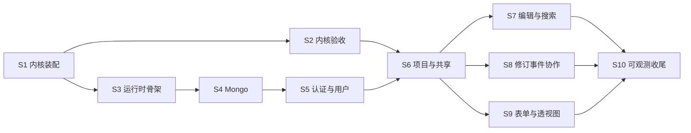

# 07 · 后端移植工作项清单

> 依据 [`01-后端架构与移植清单.md`](01-后端架构与移植清单.md) 逐节拆出的工作项，并对照代码核对完成状态；任务号对应 [`05-任务拆分与验收.md`](05-任务拆分与验收.md)。
> 核对时间：2026-10-07；分支 `backend-framework-build`，最新提交 `9ddace4`。
> 2026-10-07 第三轮：原 🟢 项已在 `716d1b1`、`c1dfbe5`、`110971d`、`075ac8b` 中提交，统一改记 ✅；全部未完成项已划分为实施阶段 S1–S10（见"实施阶段划分"），各表"阶段"列即对应标识，已完成项记"—"。
> 2026-10-08 第四轮：完成 S1（内核装配）和 S2（内核验收与 P0 收尾）的全部工作项，`mvnw -Plegacy-compat verify` 全绿。改动已在 `76f27a8`、`506ea8d`、`40d58d2`、`40e889f` 中提交，相关项记 ✅。详见文末"处理记录（第四轮）"。
> 2026-10-08 第五轮：完成 S3（应用运行时骨架）的 3 个工作项 3.4-2、2-3、7-4，`mvnw -Plegacy-compat verify` 全绿。改动已在 `7e50ead` 中提交，相关项记 ✅。详见文末"处理记录（第五轮）"。
> 2026-10-08 第六轮：完成 S4（Mongo 持久化与迁移）的 5 个工作项 5.3-1、5.3-2、5.3-3、7-1、8-5，`mvnw -Plegacy-compat verify` 全绿（本机用内存实现的 Mongo，CI 用 `mongo:7.0` 容器）。改动已在 `3d59ed2` 中提交，相关项记 ✅。详见文末"处理记录（第六轮）"。
> 2026-10-08 第七轮：完成 S5（认证与用户管理）的 10 个工作项 6-1~6-6、5.1-15、5.1-16、8-1、8-2，`mvnw -Plegacy-compat verify` 全绿（本机用内存 Mongo 和进程内的令牌签发方，CI 用 `mongo:7.0` 和 Keycloak 容器）。改动已在 `4b1d9b0` 中提交，相关项记 ✅。详见文末"处理记录（第七轮）"。
> 2026-10-09 第八轮：完成 S6（项目管理与共享）的 5 个工作项 5.1-10、5.1-12、5.1-13、8-3、8-4，并补上 02 §3 中属于这些服务的端点、上传和下载。2026-10-10 补做了因用量上限中断的安全审查（处理了上传相关的 4 项）和变异检查（24 个全部被发现），之后 `mvnw -Plegacy-compat verify` 全绿。改动已在 `8aae075` 中提交，相关项记 ✅。详见文末"处理记录（第八轮）"。

## 图例与汇总

| 状态 | 含义 | 数量 |
|---|---|---|
| ✅ | 已完成，已提交 | 66 |
| 🟢 | 代码已写完，但未提交（只在工作区） | 0 |
| 🟡 | 部分完成 | 0 |
| ⬜ | 未开始 | 17 |
| | **合计** | **83** |

> 第四轮完成并提交的 4 项是 2-1、2-2、2-4（S1）和 3.3-13（S2），已计入 ✅；S2 的其余工作是附表中 P0 任务的验收测试，不计入上表。
> 第五轮完成并提交的 3 项是 S3 的 2-3、3.4-2、7-4（`7e50ead`），已计入 ✅。
> 第六轮完成并提交的 5 项是 S4 的 5.3-1、5.3-2、5.3-3、8-5，以及原先 🟡 的 7-1（`3d59ed2`），已计入 ✅。
> 第七轮完成并提交的 10 项是 S5 的 6-1~6-6、5.1-15、5.1-16、8-1、8-2（`4b1d9b0`），已计入 ✅。
> 第八轮完成并提交的 5 项是 S6 的 5.1-10、5.1-12、5.1-13、8-3、8-4（`8aae075`），已计入 ✅。

> 2026-10-07 第二轮：处理了原先 6 个 🟡 项，其中 5 项改为 🟢；7-1 只剩 Mongo 健康检查，要等 Mongo 接入（5.3 / P1-02）。详见文末"处理记录"。

总的情况：
- §3 内核的代码已写完并提交（主要在 `110971d`）。
- 内核装配层（`ProjectContext`、`ProjectContextFactory`、`ProjectIndexes`）已在 S1 完成。
- P0 的验收测试和退出标准已在 S2 完成：新旧内核对比放在新模块 `wp-legacy-compat`（只在 `-Plegacy-compat` 下构建），性能基线见 [`perf/P0-baseline.md`](perf/P0-baseline.md)。
- 应用运行时骨架已在 S3 完成：`wp-app` 新增 `app.project` 包（`KernelExecutors`、`ProjectRegistry`、`ProjectRuntimeProperties`、`ProjectRuntimeAutoConfiguration`）。`ProjectContextFactory` 和 `ProjectRegistry` 只在存在 `ProjectPorts` bean 时创建。`ProjectPorts` 已在 S6 组装为 `MongoProjectPorts`（含按标签条件打标的 `TagsManager`），wp-server 启动时创建注册表，可以加载项目。
- Mongo 持久化已在 S4 完成：19 个旧集合各有仓库，读写的文档与旧代码逐字节一致（只少了 `className`）；`wp-cli` 有了 picocli 骨架和 `migrate-mongo`；健康检查包含 `mongo`。
- 认证与用户管理已在 S5 完成：`wp-app` 有了 `AccessManager`（`require()` 不通过时抛 `PermissionDeniedException`，返回 403）、`UserService`、`ApiKeyService`、`ApplicationSettingsService`；`wp-api` 有了无状态的 Security 链（Keycloak JWT、API Key、本地兜底登录）、Problem JSON 错误、`/api/v1/me`、`/me/api-keys`、`/admin/settings`、`/admin/users`；`wp-cli` 有了 `create-admin` 和 `generate-api-key`。
- 项目管理与共享已在 S6 完成：`wp-app` 有了 `ProjectService`、`ProjectSettingsService`、`SharingService`、`PermissionService`，以及替代旧 servlet 的 `UploadService`、`ProjectDownloadService`；`wp-api` 有了 02 §3 的项目、设置、共享、上传、下载端点（`search-settings` 和设置导入导出除外）和 `/admin/permissions/rebuild`；`wp-cli` 有了 `rebuild-permissions`、`set-permissions`。
- §5–§8 的其余部分（本体、修订、事件、表单、透视图等应用服务和端点，`reindex-lucene`）都没开始。

## 实施阶段划分

未完成的 44 项（1 个 🟡、43 个 ⬜），加上附表里 P0 任务尚缺的验收测试，按业务关联和依赖顺序分为 10 个阶段。划分原则：

- 同一阶段的工作项属于同一业务域，共用同一批数据或组件。例如事件广播、webhook、邮件都由项目事件驱动，所以放在同一阶段。
- 一个阶段只依赖排在它前面的阶段，完成后能用一组测试单独验收。
- 阶段标识用 `S`（Stage），以区别于 05 文档的里程碑 P0–P4；"对应 05 任务"一列给出两者的对应关系。

### 阶段总览

| 阶段 | 主题 | 包含工作项 | 前置阶段 | 对应 05 任务 | 状态 |
|---|---|---|---|---|---|
| S1 | 内核装配 | 2-1、2-2、2-4；P0-08 验收 | — | P0-04 剩余部分、P0-08 | ✅ 已完成 |
| S2 | 内核验收与 P0 收尾 | 3.3-13；P0-03、P0-05、P0-06、P0-07、P0-09、P0-10 验收；P0 退出标准 | S1 | P0-03、P0-05~P0-07、P0-09、P0-10 | ✅ 已完成 |
| S3 | 应用运行时骨架 | 2-3、3.4-2、7-4 | S1 | P1-01 | ✅ 已完成 |
| S4 | Mongo 持久化与迁移 | 5.3-1、5.3-2、5.3-3、7-1、8-5 | S3 | P1-02 | ✅ 已完成 |
| S5 | 认证与用户管理 | 6-1~6-6、5.1-15、5.1-16、8-1、8-2 | S4 | P1-03、P1-14（部分） | ✅ 已完成 |
| S6 | 项目管理与共享 | 5.1-10、5.1-12、5.1-13、8-3、8-4 | S2、S5 | P1-04、P1-14（部分） | ✅ 已完成 |
| S7 | 本体编辑与搜索 | 5.1-1~5.1-5、5.1-14 | S6 | P1-05、P1-06 | ⬜ |
| S8 | 修订、事件与协作通知 | 5.1-7、5.1-8、5.1-11、5.2-1、5.5-1、5.5-2 | S6 | P1-08、P1-09、P1-10 | ⬜ |
| S9 | 表单与透视图 | 5.1-6、5.1-9 | S6 | P1-07、P1-11 | ⬜ |
| S10 | 可观测与运维收尾 | 7-2、7-3、8-6 | S3–S9 | P1 退出前 | ⬜ |

S1 之后分两条线：S2（内核验收）与 S3 → S4 → S5（应用基础）可以并行，在 S6 合流。S7、S8、S9 互不依赖，可以并行或按任意顺序做。

### S1 内核装配（P0-08 收尾）

- **工作项**：按依赖顺序实现 2-4 `ProjectIndexes` → 2-2 `ProjectContextFactory` → 2-1 `ProjectContext`。
- **为什么放在一起**：三者共同构成"每个项目一张对象图"。`ProjectContextFactory` 要靠 `ProjectIndexes` 建索引，`ProjectContext` 是它的产物；项目读写锁（3.4-1 已验证）此时改由 `ProjectContext` 持有。线程池作为构造参数传入，提供线程池的 `KernelExecutors` bean 放到 S3。
- **完成标志**：`ChangeManagerIT` 通过，覆盖"创建类 → 索引可见 → 修订追加 → 事件桶里有 `ClassFrameChanged` 和 `EntityHierarchyChanged` → Lucene 可搜"；`ProjectContext.close()` 释放本项目的资源，但不关闭传入的线程池。
- **完成情况（第四轮，✅ `76f27a8`）**：已达到完成标志。`ProjectIndexesTest` 6 个、`ChangeManagerIT` 2 个、`ProjectContextFactoryIT` 6 个用例通过；变异检查：去掉 Lucene 全量建索引后 `shouldRebuildMissingLuceneIndexWhenLoading` 失败。

### S2 内核验收与 P0 收尾

- **工作项**：3.3-13 `kernel.io.merge` 原样移植；附表中 P0-03、P0-05、P0-06、P0-07、P0-09、P0-10 尚缺的验收测试；P0 退出标准（性能基线、CI）；修正 01 和 05 文档里的两处描述（实体 JSON 格式见 4-6，`amino-acid-form.json` 见附表 P0-10）。
- **为什么放在一起**：都是验证已完成的内核与旧系统行为一致，共用同一批测试数据。merge 与上传、下载同属 `kernel.io`，和 P0-09 的往返测试一起做。
- **先准备测试数据**：pizza.owl；旧 BinaryOWL 样本或一个真实项目目录；一份按当前 `FormDescriptor` 格式导出的表单 JSON。P0-05 还要把旧 `webprotege-server-core` jar 作为测试依赖引入。
- **完成标志**：达到 05 文档的 P0 退出标准：上述验收测试在 CI 中通过；`docs/perf/P0-baseline.md` 记录加载 50k 公理项目的耗时，且不超过旧系统的 1.2 倍。
- **完成情况（第四轮，✅ `506ea8d`、`40d58d2`、`40e889f`）**：验收测试全部通过，性能比值 1.01；新旧对比测试放在新模块 `wp-legacy-compat`，CI 新增 `legacy-compat` 作业（本地按其步骤模拟通过，远端首次运行要等推送后确认）。数据上的两处变通：仓库里没有原版 pizza.owl，改用自写的同结构测试本体；没有真实项目目录，改用"pizza 导入 + 300 条确定性编辑"的历史代替，并保留 `-Dwp.compat.projectDirectory` 参数供拿到真实项目时直接对比。

### S3 应用运行时骨架（P1-01）

- **工作项**：3.4-2 `KernelExecutors` → 2-3 `ProjectRegistry` → 7-4 优雅停机。
- **为什么放在一起**：三者都管项目在进程里的生命周期。`KernelExecutors` 提供共享线程池；`ProjectRegistry` 用这些线程池和 S1 的 `ProjectContextFactory` 按需加载项目，空闲过期时关闭；停机时 `closeAll()` 等待修订写盘完成。`ProjectRegistry` 同时接上已有的 `DataDirectoryLayout` bean（5.4-1）。
- **完成标志**：驱逐测试中，项目空闲 1 秒后 `ProjectContext.close()` 被调用；同一项目被并发加载时只构造一次；停机时尚未完成的修订全部落盘。
- **完成情况（第五轮，✅ `7e50ead`）**：已达到完成标志，均在真实内核上验证。`ProjectRegistryIT.shouldCloseProjectOnceItHasBeenDormantForTheDormantTime`：空闲 1 秒后 `close()` 被调用，且距最后一次使用不少于 1 秒。`shouldLoadProjectOnceWhenItIsRequestedConcurrently`：16 个线程同时请求，只构造一次，拿到的是同一个上下文。`ProjectRuntimeShutdownIT`：4 条修订卡在写盘线程池时关闭 Spring 容器，重新加载后 5 条修订都在。6 个变异检查全部被测试发现（见"处理记录（第五轮）"）。运行中的服务要到 S4/S5 提供 `ProjectPorts` 后才会创建注册表，见 2-3。

### S4 Mongo 持久化与迁移（P1-02）

- **工作项**：5.3-1 19 个集合的 `*Document` 和仓库；5.3-2 不写 `_class`；5.3-3 `OwlEntityMongoCodec`；8-5 `migrate-mongo`；7-1 剩下的 Mongo 健康检查。
- **为什么放在一起**：都是为了与旧 Mongo 数据兼容。仓库实现 `kernel-api` `port` 包里已有的接口。8-5 是迁移入口，顺带搭好 `wp-cli` 的 picocli 骨架，供 S5、S6、S10 的命令复用；7-1 在引入 Mongo starter 后由 Spring Boot 自动提供。
- **注意**：验收要用 Testcontainers，本机目前没有 Docker，需要在 CI 或装有 Docker 的机器上运行。
- **完成标志**：导入旧 `mongoexport` 样本后，每个仓库都能读出正确的对象；写回后与原文档相比只少了 `className`；`/actuator/health` 包含 `mongo` 且为 UP。
- **完成情况（第六轮，✅ `3d59ed2`）**：已达到完成标志。样本由旧代码自己写出，代替 `mongoexport`（`LegacyMongoDocumentsIT`，见 5.3-3）。`LegacyMongoRoundTripIT` 对 19 个集合逐一验证：导入带 `className` 的样本，经仓库读出的对象与期望值相等，再经仓库写回后，文档与样本的 canonical Extended JSON 完全相同（字段顺序和 BSON 类型都一致），只少了 `className`。有两个例外由旧代码本身决定：`ProjectAccess` 只能用 `$inc` 更新，所以写回后只有 `count` 加 1；webhook 是删除后重新插入，所以 `_id` 是新的。冒烟测试断言 `"mongo":{"status":"UP"}`。`migrate-mongo` 由 `MongoMigrationIT`（逻辑）和 `MigrateMongoCommandIT`（命令行）验证。本机没有 Docker，测试跑在内存实现的 mongo-java-server 上；CI 用 `-Dwp.test.mongo=container` 在 `mongo:7.0` 容器上运行同一批测试，远端首次运行要等推送后确认。5 个变异检查全部被测试发现（见"处理记录（第六轮）"）。

### S5 认证与用户管理（P1-03、P1-14 部分）

- **工作项**：6-1~6-6（JWT、管理员角色映射、API Key、本地兜底登录、无状态认证、兼容层安全链）；5.1-15 `UserService` 和 `ApplicationSettingsService`；5.1-16 `accessManager.require()` 与 403；8-1 `create-admin`；8-2 `generate-api-key`。
- **为什么放在一起**：都回答"调用者是谁、有哪些应用级权限"。首次登录要通过 `UserService` 写入 `Users`；API Key 过滤器查询 `UserApiKeys`；`create-admin` 和 `generate-api-key` 用来创建首个管理员和 API Key。5.1-16 在这一阶段建立机制，之后各阶段新写的服务都要遵守。
- **完成标志**：Keycloak Testcontainer 下，有 JWT、有 API Key、无凭证三种请求分别得到正确的用户或 401；缺少权限的服务调用抛出 `PermissionDeniedException` 并返回 403；`create-admin` 之后该用户的应用权限包含 `EDIT_APPLICATION_SETTINGS`；`generate-api-key` 生成的 Key 能通过认证；旧 `AccessManagerImpl_TestCase` 转换后通过。
- **完成情况（第七轮，✅ `4b1d9b0`）**：已达到完成标志，逐条对应如下。
  - **三种请求**：`wp-api` 的 `AuthenticationIT`（18 个用例）通过 HTTP 验证：Keycloak 令牌得到 `editor` 本人，并在首次请求时写入 `Users`；`generate-api-key` 同一方法生成的 Key 得到 `viewer`；无凭证、未知 Key、篡改过的令牌、其他签发方的令牌都是 401，响应为 Problem JSON（`code: UNAUTHENTICATED`）并带 `WWW-Authenticate: Bearer`。令牌来自 `OidcTestServer`：有 Docker 时是导入 `deploy/keycloak/webprotege-realm.json` 的 `quay.io/keycloak/keycloak:26.4` 容器（测试为 `webprotege-web` 打开密码授权，用 realm 里的开发账号登录）；本机没有 Docker，跑的是进程内的签发方，它提供发现文档和公钥，按 Keycloak 的格式为同一 realm 文件中的用户签发令牌。CI 用 `-Dwp.test.oidc=container` 强制使用容器，远端首次运行要等推送后确认。
  - **403**：`viewer` 调 `GET /api/v1/admin/settings` 得到 403，`code: PERMISSION_DENIED`，`detail` 说明缺少 `EditApplicationSettings`。服务层由 `UserServiceIT`、`ApplicationSettingsServiceIT`、`ApiKeyServiceIT`、`MongoAccessManagerIT` 验证。
  - **`create-admin`**：`wp-cli` 的 `CreateAdminCommandIT` 运行命令后，该用户在应用上的动作闭包包含 `EditApplicationSettings`；`UserServiceIT` 和 `LocalLoginIT` 也验证了 `/me` 的 `applicationActions` 中有它（05 文档写作 `EDIT_APPLICATION_SETTINGS`，实际输出是动作 id `EditApplicationSettings`，见 02 §2 的说明）。
  - **`generate-api-key`**：`GenerateApiKeyCommandIT` 从命令输出中取出 Key，它在 `UserApiKeys` 中查得到该用户，库里只存哈希。它经 HTTP 能通过认证，由 `AuthenticationIT.anApiKeyShouldAuthenticateItsUser` 验证：两者用的是同一个 `ApiKeyService.generateApiKeyForUser`（`wp-cli` 不能依赖 `wp-api`，所以无法在一个测试里串起来）。
  - **旧测试**：旧仓库里叫 `AccessManagerImpl_IT`（07、05 写成了 `_TestCase`），6 个用例转换为 `MongoAccessManagerIT$Legacy` 并通过；同包的 `Role_TestCase`、`RoleAssignment_TestCase`、`Subject_*_TestCase`（3 个）、`ApplicationResource_TestCase`、`ProjectResource_TestCase`，以及 `ApiKeyManager_IT`、`ApiKeyHasher_TestCase`、`ApiKeyParser_TestCase`、`UserDetailsManagerImpl_TestCase` 也已转换。

### S6 项目管理与共享（P1-04、P1-14 部分）

- **工作项**：5.1-13 `ProjectService`；5.1-12 `ProjectSettingsService`；5.1-10 `SharingService` 和 `PermissionService`；8-3 `rebuild-permissions`；8-4 `set-permissions`。
- **为什么放在一起**：都以项目为单位：创建（空项目或上传导入）、列表、设置、回收站，以及谁能访问这个项目。两条 CLI 命令直接操作项目的角色分配。上传导入依赖 S2 的 P0-09 验收，权限检查依赖 S5。
- **完成标志**：创建（空项目 / 上传）→ 三种过滤条件的列表 → 设置读写 → 分享给其他用户 → 移入回收站再恢复，整个流程跑通；`set-permissions` 之后该用户的项目权限立即生效。
- **完成情况（第八轮，✅ `8aae075`）**：已达到完成标志，逐条对应如下。
  - **整个流程**：`wp-api` 的 `ProjectsControllerIT.projectsShouldBeCreatedListedSetUpSharedTrashedAndRestored` 经 HTTP 走完一遍：`editor` 建一个空项目和一个由上传文档导入的项目（201 和 `Location`）→ `filter=owned`/`shared`/`trash` 三个列表各自正确 → 读写设置（含 webhook）、前缀，读语言使用情况和语言标签 → 把项目分享给 `viewer`（VIEW）后，`viewer` 的 `shared` 列表里有它，能读详情，`permissions` 含 `ViewProject` 不含 `EditOntology`，改设置、读共享设置、移入回收站都是 403 → `editor` 移入回收站（`owned` 里没了，`trash` 里有了，`viewer` 的 `shared` 里也没了）再恢复。服务层由 `ProjectServiceIT`、`ProjectSettingsServiceIT`、`SharingServiceIT` 等逐项验证（见"构建与测试结果"）。
  - **`set-permissions` 立即生效**：`wp-cli` 的 `SetPermissionsCommandIT` 在独立的 Spring 容器里（相当于另一个进程）运行命令后，测试自己的 `AccessManager`（相当于运行中的服务）马上看到新角色；`ProjectsControllerIT.aRoleSetFromTheCommandLineShouldApplyToTheNextRequest` 用命令调用的同一个 `SharingService.setUserPermission` 设置角色，下一个 HTTP 请求的 `permissions` 就包含 `EditOntology`。权限不缓存（01 §5.1），所以无需通知服务。
  - **05 P1-04 的其余验收**：5 种格式的下载由 `ProjectsControllerIT.everyFormatShouldBeDownloadable` 验证；旧下载参数的宽松解析（旧 `FileDownloadParametersTestCase`）由 `theLegacyDownloadParametersShouldStayLenient` 验证。
  - **`ProjectPorts` 与注册表**：`MongoProjectPortsIT` 验证注册表加载的项目从 Mongo 取标签（含按条件打的标签）、按访问管理器检查 `CREATE_*`、读本项目的搜索过滤器；`wp-server` 冒烟测试断言注册表和项目服务都存在（S3、S5 留下的事项）。
  - **旧测试**：旧 `CreateNewProjectActionHandler_TestCase`、`GetProjectDetailsActionHandler_TestCase`、`Get/SetProjectSettingsActionHandler_TestCase`、`Get/SetProjectSharingSettingsActionHandler_TestCase`、`GetProjectPermissionsActionHandler_TestCase` 原先用 mock 验证 handler，转换为各服务 IT 的 `$Legacy` 嵌套类，改在真实的 Mongo 和注册表上运行；`FileDownloadParametersTestCase` 见上。

### S7 本体编辑与搜索（P1-05、P1-06）

- **工作项**：5.1-1 帧、Manchester、本体服务；5.1-2 实体与渲染；5.1-3 层级与批量编辑；5.1-4 个体；5.1-14 公理；5.1-5 搜索与搜索设置。
- **为什么放在一起**：都是对单个项目本体的读写，直接调用 `ProjectContext` 里的内核组件；搜索还为编辑提供实体补全。
- **完成标志**：创建类（指定父类）→ 层级中出现该子类 → 在帧上加注解 → 并发修改时返回 409 → Manchester 校验报出错误的行列 → 合并实体 → 删除，整个流程跑通；在 pizza 项目中搜索 "mozz" 命中 `MozzarellaTopping`。

### S8 修订、事件与协作通知（P1-08、P1-09、P1-10）

- **工作项**：5.1-7 `RevisionService`；5.1-8 `ProjectEventService`；5.2-1 `ProjectEventBroadcaster`；5.5-2 webhook 调用；5.5-1 `MailSender`；5.1-11 标签、关注、讨论服务。
- **为什么放在一起**：都消费 `ChangeManager` 产生的修订和事件。广播器把事件推给 SSE，同时触发 webhook 和邮件；邮件的两个模板正好是评论通知和关注通知。
- **完成标志**：回滚修订后帧恢复原状；按实体查询变更时只返回该实体的变更；A 创建类后，B 的订阅在 1 秒内收到事件，按 `since` 补发时不丢不重；评论里 `@user` 和关注实体的变更都会触发邮件（用 GreenMail 验证）；webhook 收到 `{projectId, userId, revisionNumber, timestamp}`。

### S9 表单与透视图（P1-07、P1-11）

- **工作项**：5.1-6 表单描述符与表单数据服务；5.1-9 透视图服务。
- **为什么放在一起**：两者都是按项目保存、供前端渲染的界面配置（对应 `Forms`/`FormSelectors` 和 `PerspectiveDescriptors`/`PerspectiveLayouts` 集合），也是前端 P2-03、P2-12 的前置。表单数据读写依赖 S2 中 P0-10 的表单端到端验收。
- **完成标志**：导入当前格式的表单 JSON → 读取实体的表单数据 → 修改一个字段 → 产生修订；把表单复制到另一个项目；新用户第一次获取透视图时得到 8 个内置标签页，写入的布局 JSON 读出后字节级一致，重置后恢复内置布局。

### S10 可观测与运维收尾（P1 退出前）

- **工作项**：7-2 6 个自定义指标；7-3 日志 MDC；8-6 `reindex-lucene`。
- **为什么放在一起**：都是横跨多个阶段的运维能力，要等被观测的组件都就位后再统一接入：项目加载指标依赖 S3，变更和搜索指标依赖 S7，SSE 连接数依赖 S8，MDC 里的 `userId` 依赖 S5。
- **完成标志**：6 个指标出现在 `/actuator/prometheus` 中；日志行带有 `projectId`、`userId`、`traceId`；`reindex-lucene` 重建索引后，搜索结果与重建前一致。

> 本清单只覆盖 01 文档。02 文档的 REST 端点、`/data/*` 兼容层（P1-13）、`wp-integration`（P1-12）和 OpenAPI（P1-15）不在本清单内，建议在 S6–S9 实现对应服务时一并补上相应端点。

## 构建与测试结果

第八轮（S6）完成后（2026-10-10 处理完安全审查后重跑），对全部 12 个模块运行 `mvnw -Plegacy-compat verify`（包含 spotless 和 checkstyle），结果 **BUILD SUCCESS**，checkstyle 0 违规。本机没有 Docker，Mongo 测试跑在内存实现上，安全测试的令牌来自进程内的签发方；CI 分别用 `mongo:7.0` 和 Keycloak 容器：

| 模块 | 单元测试 | 集成测试 |
|---|---|---|
| `wp-domain` | 1072 个全部通过 | 5 个全部通过 |
| `wp-kernel-api` | 169 个全部通过 | — |
| `wp-kernel` | 1012 个全部通过（第三轮 968，第四轮新增 `kernel.io.merge` 30 个、`ProjectIndexesTest` 6 个，S6 新增 `RawProjectSourcesImporterTest` 5 个、`UploadedOntologiesProcessorTest` 3 个） | 47 个全部通过（第三轮 23，新增 24 个，见"处理记录（第四轮）"） |
| `wp-app` | 91 个全部通过（S3 13 个，S4 15 个，S5 新增 63 个：`SubjectTest` 20、`ResourceTest` 12、`RoleTest` 8、`RoleOracleTest` 6、`RoleAssignmentDocumentTest` 6、`ApiKeyParserTest` 8、`AccessChangePermissionCheckerTest` 2、`ApiKeyServiceTest` 1） | 180 个全部通过（S3 11 个，S4 73 个，S5 42 个，S6 新增 54 个：`ProjectServiceIT` 15、`ProjectSettingsServiceIT` 12、`SharingServiceIT` 9、`PermissionServiceIT` 4、`UploadServiceIT` 6、`ProjectDownloadServiceIT` 4、`MongoProjectPortsIT` 4） |
| `wp-api` | 7 个全部通过（S5 `UserJwtAuthenticationConverterTest` 4，S6 新增 `JsonConfigurationTest` 3） | 35 个全部通过（S5 25 个，S6 新增 `ProjectsControllerIT` 9、`UploadLimitsIT` 1；S5 的 `AuthenticationIT`、`ApiKeySettingsIT` 中 3 个用例改用真实的 `/download`） |
| `wp-cli` | — | 13 个全部通过（S4 `MigrateMongoCommandIT` 4，S5 `CreateAdminCommandIT` 3、`GenerateApiKeyCommandIT` 2，S6 新增 `SetPermissionsCommandIT` 3、`RebuildPermissionsCommandIT` 1） |
| `wp-server` | 12 个全部通过（S5 在冒烟测试中新增 2 个；S6 新增 2 个：注册表和项目服务已装配、上传大小限制的绑定） | — |
| `wp-legacy-compat`（仅 `-Plegacy-compat`） | — | 14 个：12 个通过，2 个跳过（需要 `-Dwp.compat.projectDirectory` 指定真实项目）；S5 新增 `LegacyRoleClosuresIT` 1 个 |

不带 profile 的 `mvnw verify`（即现有 `backend` CI 作业）不构建 `wp-legacy-compat`，不需要旧系统 jar。CI 新增的 `legacy-compat` 作业的步骤（安装内核 → 单独构建 `wp-legacy-compat`）已在本地模拟通过。

第一轮核对时，`wp-kernel` 的 `FormDescriptor_Serialization_IT` 有 2 个失败，第二轮已修复（见"处理记录"）。

---

## §1 分层职责

| # | 工作项 | 状态 | 阶段 | 依据 / 说明 |
|---|---|---|---|---|
| 1-1 | 10 个模块的骨架；构建检查规则限制模块分层，并保证 domain、kernel-api、kernel 不依赖 Spring | ✅ | — | 提交 `865581c`（P0-01） |

## §2 项目级对象图：`ProjectContext`

| # | 工作项 | 状态 | 阶段 | 依据 / 说明 |
|---|---|---|---|---|
| 2-1 | `ProjectContext`：持有索引、修订、层级、字典、渲染、CRUD、事件、`ChangeManager` 和读写锁，提供 `close()` | ✅ | S1 | 提交 `76f27a8`。新增 `kernel.project.ProjectContext`，另持有 `LanguageManager`、Lucene 索引写入器（供以后的 `reindex-lucene`）、`DeprecatedEntityChecker`、`EntityNodeRenderer`、`MatchingEngine`、`MatcherFactory`、`DefaultOntologyIdManager`；四个层级放在新 record `HierarchyProviders`。`close()` 幂等，先取写锁等待读写结束，再按打开的逆序释放（事件清理任务 → Lucene searcher → writer → directory → 等待修订写盘），不关闭共享线程池。`ProjectContextFactoryIT` 验证：关闭后线程池仍在运行、Lucene 写锁已释放（可再次打开）、`ChangeManager` 在该锁下写入（持有读锁时写入排队） |
| 2-2 | `ProjectContextFactory.create()`：按旧 `ProjectModule` 的顺序构造（目录 → 加载修订 → 索引 → 建索引 → 层级 → Lucene → `ChangeManager`） | ✅ | S1 | 提交 `76f27a8`。新增 `kernel.project.ProjectContextFactory`，手写替代旧 `ProjectModule`、`IndexModule`、`ShortFormModule`、`LuceneModule` 的 provider；应用层协作者通过新接口 `ProjectPorts` 注入，共享线程池通过 record `KernelThreadPools` 注入，事件保留期可配置。旧代码里经 `Provider` 每次新建的对象照旧每次新建：事件翻译器（持有一次变更的前后状态）和 Lucene 文档翻译器（读取当前搜索过滤器）。构造失败时释放已打开的资源。`ProjectContextFactoryIT` 验证：空项目可打开；关闭后重新打开能看到修订、层级和 Lucene 索引；Lucene 索引目录被删除后重新全量构建；同一项目重复打开失败后不泄漏资源 |
| 2-3 | `ProjectRegistry`（放在 `wp-app`）：用 Caffeine 实现空闲过期，过期时调用 `close()`，加载时按项目加锁 | ✅ | S3 | 提交 `7e50ead`。新增 `app.project.ProjectRegistry`，替代旧 `ProjectCache` 和 `ProjectCacheManager`。Caffeine `expireAfterAccess(webprotege.project.dormant-time)` 判断项目何时空闲；注册表自己的线程在下一个项目到期时被唤醒，在该线程上关闭（旧实现每 30 秒检查一次）。哪个上下文处于打开状态由注册表自己记录，不依赖 Caffeine 的移除通知，因为通知是异步的：打开和关闭都在该项目的锁内进行（与旧实现一样，按 interned `ProjectId` 加锁），并保证旧上下文关闭后才打开新的，否则新上下文拿不到 Lucene 写锁。不同项目可以同时加载。`getIfLoaded` 对应旧 `getProjectEventManagerIfActive`，读取时不算使用，所以轮询不会让项目一直保持加载。`ProjectRuntimeAutoConfiguration` 用已有的 `DataDirectoryLayout` bean（5.4-1）和 `ProjectPorts` bean 构造 `ProjectContextFactory` 和注册表；`ProjectPorts` 要等 S4/S5 提供，在此之前服务照常启动，但不创建这两个 bean。`ProjectRegistryIT` 10 个用例。第八轮起 `ProjectPorts` 由 `MongoProjectPorts` 提供，wp-server 启动即创建注册表；条件同时从嵌套配置类移到 bean 方法上（见"处理记录（第八轮）"） |
| 2-4 | `ProjectIndexes`：显式创建全部索引实现并按构造器依赖连线，提供 `get(Class)` 和 `updatable()` | ✅ | S1 | 提交 `76f27a8`。新增 `kernel.index.ProjectIndexes`。每个实现按自身类和直接实现的 `kernel.api.index` 接口登记，同一接口出现两个实现时报错；`get` 不限定 `T extends Index`，因为 `RootIndex` 等 8 个接口不继承 `Index`（01 §3.2 规则 3 已同步修正）。构造分两步：`builder()` 创建全部基于公理的索引，`build(...)` 在类层级、字典、Lucene 建好后补上 `IndividualsIndex`、`IndividualsByTypeIndex` 和两个 Lucene 版 deprecated 索引（与旧绑定一致）。`ProjectIndexesTest` 6 个用例：从类路径扫描 `kernel.api.index` 的全部接口并逐个取到实现；`updatable()` 恰为 17 个主索引；每个派生索引的依赖都是已登记的同一实例 |

## §3 内核移植

### §3.1 变更模型与修订

| # | 工作项 | 状态 | 阶段 | 依据 / 说明 |
|---|---|---|---|---|
| 3.1-1 | `kernel.api.change`：`OntologyChange` 等 16 个，AutoValue 改为 record | ✅ | — | 提交 `ff39f5e` |
| 3.1-2 | `kernel.api.revision` | ✅ | — | 提交 `ff39f5e` |
| 3.1-3 | BinaryOWL 修订存储 `BinaryOwlRevisionStore`；新增 `RevisionStore` 接口（`load/append/getRevisions/getHead`）；写盘线程改为外部注入 | ✅ | — | 已改名为 `kernel.revision.BinaryOwlRevisionStore`。接口改为 `load/append/getRevisions/getRevision/getHead`，并继承 `HasDispose`。写盘线程池由 `RevisionStoreFactory` 注入：在共享线程池上，每个 store 用一条 `CompletableFuture` 链保证按修订号顺序追加；`dispose()` 只等待本 store 未完成的写盘（最长 1 分钟），不关闭共享线程池。`BinaryOwlRevisionStoreIT` 12 个用例通过，其中新增"4 线程共享池下 50 条修订按序落盘"和"`dispose` 不关闭共享池"；还修正了旧测试的一个 bug：重新加载后断言的是原 store，导致"重新加载可见"从未被真正验证 |
| 3.1-4 | `RevisionManager`、`ProjectChangesManager`、`EntitiesByRevisionCache` | ✅ | — | `kernel/revision` |
| 3.1-5 | 变更生成器全家（`HasApplyChanges`、`ChangeListGenerator`、`Create*`、`Delete*`、`Merge*`、`Move*`、`RevisionReverter*`、`FindAndReplaceIRIPrefix*` 等）和 bulkop；`@AutoFactory` 改为手写工厂 | ✅ | — | `kernel/change` 32 个文件，加 `change/bulkop` 6 个 |
| 3.1-6 | `change.description`（43 个） | ✅ | — | 43 个，数量一致 |
| 3.1-7 | `change.matcher`（21 个） | ✅ | — | 21 个，数量一致 |
| 3.1-8 | `ChangeManager`：权限检查上移到 `wp-app`；原来的 webhook 和 `setModified` 改为发布 `ProjectChangedKernelEvent` | ✅ | — | `EDIT_ONTOLOGY` 由应用服务在调用前检查；创建实体时的 `CREATE_*` 权限通过 `kernel.api.port.ChangePermissionChecker` 回调应用层；项目变更改为通知 `ProjectChangedKernelEvent` 监听器 |
| 3.1-9 | 写路径顺序保持不变（生成变更 → 铸造 fresh IRI → 计算有效变更 → 事件预处理 → 更新索引 → 活跃语言 → 字典 → 追加修订 → 4 个层级 → 释放写锁 → 高层事件 → 投递事件） | ✅ | — | [`ChangeManager.java`](../wp-kernel/src/main/java/org/industrial/ontology/kernel/change/ChangeManager.java) 第 308–463 行的顺序与文档一致 |

### §3.2 索引

| # | 工作项 | 状态 | 阶段 | 依据 / 说明 |
|---|---|---|---|---|
| 3.2-1 | 索引接口 `kernel.api.index` | ✅ | — | 提交 `ff39f5e`（65 个文件） |
| 3.2-2 | 17 个主索引（`UpdatableIndex`） | ✅ | — | 全部存在，已去掉 `Impl` 后缀 |
| 3.2-3 | 派生索引（`DependentIndex`），含 `RootIndex`、帧、属性、签名系列等 | ✅ | — | `kernel/index`；`BuiltInOwlEntitiesIndexImpl` 和 `BuiltInSkosEntitiesIndexImpl` 放在了 `kernel-api`，且保留了 `Impl` 后缀，与规则 1 略有出入 |
| 3.2-4 | Lucene 版"已废弃实体"索引（2 个） | ✅ | — | `kernel/lucene/DeprecatedEntitiesIndexLucene`、`DeprecatedEntitiesByEntityIndexLucene` |
| 3.2-5 | 索引基础设施：`UpdatableIndex`、`DependentIndex`、`AxiomMultimapIndex`、`AxiomChangeHandler`、`IndexedSet`、`IndexedSetMultimaps`、`Key`、`KeyValueExtractor`、`IndexUpdater`、`Stats` | ✅ | — | 全部存在（`DependentIndex` 在 `kernel-api`） |
| 3.2-6 | `IndexUpdater` 保留分层并行更新，线程池由外部注入 | ✅ | — | `IndexUpdaterFactory` 接收外部传入的线程池 |
| 3.2-7 | 约 60 个索引测试转 JUnit 5，类名后缀 `_TestCase` 改为 `Test` | ✅ | — | 54 个转换的测试类通过。旧仓库其实没有 05 文档提到的 `IndexUpdater_TestCase`，所以依赖图分层测试是新写的：`IndexUpdaterTest` 5 个用例，用合成依赖图（含跨层依赖、并行线程池）验证"依赖全部完成后才开始"和"上一层全部完成后才开始下一层"，并覆盖全量重放和增量更新。变异检查：把分层去掉后有 3 个用例失败，说明测试有效 |

> `ProjectIndexes` 见 2-4。

### §3.3 层级、帧、渲染、短名、CRUD 工具包

| # | 工作项 | 状态 | 阶段 | 依据 / 说明 |
|---|---|---|---|---|
| 3.3-1 | 层级：`kernel.api.hierarchy`（7 个接口）和 `kernel.hierarchy`（含 4 个层级 Provider） | ✅ | — | 接口提交于 `ff39f5e`，实现 22 个文件提交于 `110971d`；4 个 Provider 测试通过 |
| 3.3-2 | 帧：`kernel.frame` 和 `frame/translator` | ✅ | — | 15 个，加 translator 21 个 |
| 3.3-3 | Manchester 语法：渲染、解析、补全、校验 | ✅ | — | `mansyntax/render` 67 个，加 `mansyntax` 7 个 |
| 3.3-4 | 渲染：`kernel.render`、`RenderingManager` | ✅ | — | `kernel/render` |
| 3.3-5 | 短名：`DictionaryManager`、`LanguageManager`、`ActiveLanguagesManager`、`BuiltInShortFormDictionary`、`LocalNameShortFormCache`、`DictionaryUpdatesProcessor` | ✅ | — | `kernel/shortform` |
| 3.3-6 | Lucene 字典与搜索，升级到 Lucene 9 API | ✅ | — | 父 POM 用 Lucene 9.12.3，`kernel/lucene` 45 个文件；旧仓库只有 3 个 Lucene 测试，均已转换。搜索验收测试 `PizzaSearchIT` 在 S2 完成（附表 P0-07） |
| 3.3-7 | CRUD 工具包：注册表、UUID / OBO-ID / SuppliedName 三种 kit、`ProjectEntityCrudKitHandlerCache` | ✅ | — | `kernel/crud`；设置仓库接口在 `kernel-api` 的 `port` 包 |
| 3.3-8 | 实体：fresh entity IRI、`IriReplacer` | ✅ | — | `FreshEntityIri` 在 `domain.entity`，`IriReplacer` 在 `kernel.api.util`，`kernel/entity` 4 个文件 |
| 3.3-9 | 条件匹配器 `kernel.match`（约 40 个） | ✅ | — | 48 个文件 |
| 3.3-10 | 事件：`ProjectEventManager`、`EventTranslatorManager`、`HighLevelEventGenerator`、`*EventComputer/Translator`；保留期可配置，默认 10 分钟 | ✅ | — | `ProjectEventManager.DEFAULT_RETENTION` 为 10 分钟；清理任务的调度线程由外部注入 |
| 3.3-11 | 下载 `kernel.io.download`（`ProjectDownloader`、`DownloadFormat`、缓存） | ✅ | — | 7 个文件 |
| 3.3-12 | 上传导入 `kernel.io.upload`（zip 和单文件提取、`RawProjectSourcesImporter`、`ProjectImporter`、`UploadedOntologiesProcessor`） | ✅ | — | 17 个文件 |
| 3.3-13 | 合并 `kernel.io.merge`（现在原样移植，P4 再接线） | ✅ | S2 | 提交 `506ea8d`。新增 `kernel.io.merge`：`merge/` 的 6 个类（`AnnotationDiffCalculator`、`AxiomDiffCalculator`、`OntologyDiffCalculator`、`ModifiedProjectOntologiesCalculator`、`OntologyPatcher`、`ProjectOntologiesBuilder`）和 `merge_add/` 的 2 个类（`MergeOntologyCalculator`、`OntologyMergeAddPatcher`），`@AutoFactory` 改为手写 `ModifiedProjectOntologiesCalculatorFactory`；旧的 8 个测试转 JUnit 5，30 个用例通过。5 个 GWT dispatch handler 不移植（01 §4），P4 由 `wp-app` 服务代替；两个 patcher 原先只从 dispatch `ExecutionContext` 取 `UserId`，现在直接接收 `UserId`。原样保留的旧行为：`MergeOntologyCalculator` 把 `List<OWLOntologyID>` 参数强转为 `ArrayList`，P4 调用方传 `List.of`/`ImmutableList` 会抛 `ClassCastException`，接线时要处理 |
| 3.3-14 | 表单内核 `kernel.form`（含 data、processor）；`EntityFrameFormDataComponent` 子组件改为普通工厂 `EntityFrameFormDataDtoBuilderFactory` | ✅ | — | 新增 `EntityFrameFormDataDtoBuilderFactory`，删除 `EntityFrameFormDataComponent` 和 `EntityFrameFormDataModule`。每次请求的 `create()` 都新建一整张对象图，原来的 Dagger 循环依赖改由 `Supplier` 打断；只共享渲染器、`BindingValuesExtractor`、签名索引、`MatchingEngine` 和过滤匹配工厂。`EntityFrameFormDataDtoBuilderFactoryTest` 3 个用例通过（文本字段、经由循环依赖的子表单、渲染缓存只在同一请求内共享）。`FormDescriptor_Serialization_IT` 已修复，2/2 通过，原因见文末"处理记录" |
| 3.3-15 | 不移植：`obo`、`collection`、`csv`、Slack webhook | ✅ | — | 均未引入（`PrefixDeclarationsCsvParser` 是内置前缀加载用的，不算 CSV 功能） |

### §3.4 并发与锁

| # | 工作项 | 状态 | 阶段 | 依据 / 说明 |
|---|---|---|---|---|
| 3.4-1 | 每个项目一把读写锁；`applyChanges` 先取变更串行锁，再取写锁 | ✅ | — | `ChangeManagerConcurrencyIT` 2 个用例通过。① 100 个线程并发 `applyChanges`：每个生成器读取当前修订号 N 并生成 `after-N` 公理，结果 100 条修订编号连续，第 k 条恰好基于 k−1 生成，重新加载修订文件后完全一致。② 持有读锁时写入会排队等待，释放后才完成。变异检查：去掉变更串行锁后用例①失败。"锁由 `ProjectContext` 持有"已随 2-1 在 S1 实现，并由 `ProjectContextFactoryIT.shouldApplyChangesUnderTheContextLock` 验证 |
| 3.4-2 | 修订写盘、事件清理、索引更新的线程池统一由 `wp-app` 的 `KernelExecutors` bean 提供；`ProjectContext.close()` 不关闭共享线程池 | ✅ | S3 | 提交 `7e50ead`。新增 `app.project.KernelExecutors`，持有三个线程池并构造 `KernelThreadPools`：索引更新 10 个线程（旧 `INDEX_UPDATING_THREADS`），修订写盘 4 个线程（旧实现每个项目一个线程，现在每个项目自己保证写盘顺序），事件清理 1 个线程；线程名 `kernel-*`，非守护线程，所以 JVM 不会在写盘中途退出。线程数可用 `webprotege.kernel.index-update-threads` 和 `revision-write-threads` 配置（新增的 `ProjectRuntimeProperties`，同时绑定已有的 `dormant-time` 和 `events.retention`）。`close()` 与旧 `ExecutorServiceShutdownTask` 一样：让已排队的任务执行完，每个线程池最多等 5 分钟。`KernelExecutorsTest` 6 个用例；"`ProjectContext.close()` 不关闭共享线程池"仍由 `ProjectContextFactoryIT` 验证 |

---

## §4 `wp-domain`

| # | 工作项 | 状态 | 阶段 | 依据 / 说明 |
|---|---|---|---|---|
| 4-1 | `domain.core`：`UserId`、`ProjectId`、`BuiltInAction`、`BuiltInRole`、`ApiKey*` 等基础类型 | ✅ | — | 提交 `4d17699` |
| 4-2 | `domain.entity`、`domain.frame`、`domain.form`、`domain.match`、`domain.lang` | ✅ | — | 提交 `4d17699` |
| 4-3 | 设置与协作类：projectsettings、crud、sharing、tag、watches、issues、perspective、change、revision、search、hierarchy、pagination、webhook（去 Slack）、app | ✅ | — | 提交 `4d17699` |
| 4-4 | 事件：去掉 GWT 父类，改为 `sealed interface ProjectEvent` 加 record；类型名为旧类名去掉 `Event` 后缀 | ✅ | — | `domain/event` 31 个文件，提交 `716d1b1`；`@JsonTypeInfo(use = NAME, property = "type")` 已覆盖 01 §5.2 列出的全部类型名 |
| 4-5 | 不移植：dispatch、place、obo（`OboId` 除外）、collection、csv、viz、auth、itemlist | ✅ | — | 均未引入 |
| 4-6 | `OwlEntityJsonTest` 固定 OWL 实体的 JSON 格式 | ✅ | — | 测试固定的是旧 `ObjectMapperProvider` 的真实输出 `{"type":"owl:Class","iri":…}`；01 §4 和 05 P0-02 原来写的 `{"@type":"Class",…}` 与之不符，已在 S2 修正。02 文档（API 契约）第 17 行原写 `@type`，第八轮已改为实际格式：S6 起 REST 的 `ObjectMapper` 注册了旧 OWL 序列化器（`api.json.JsonConfiguration`），实体 JSON 是 `type` + `owl:` 前缀 |

---

## §5 `wp-app`：应用服务与持久化

### §5.1 应用服务

| # | 工作项（包 `app.<feature>`） | 状态 | 阶段 |
|---|---|---|---|
| 5.1-1 | `frame.FrameService`、`frame.ManchesterSyntaxService`、`frame.OntologyService` | ⬜ | S7 |
| 5.1-2 | `entity.EntityService`、`entity.EntityRenderingService` | ⬜ | S7 |
| 5.1-3 | `hierarchy.HierarchyService`、`entity.BulkEditService` | ⬜ | S7 |
| 5.1-4 | `entity.IndividualsService` | ⬜ | S7 |
| 5.1-5 | `search.SearchService`、`search.SearchSettingsService` | ⬜ | S7 |
| 5.1-6 | `form.FormDescriptorService`、`form.FormDataService` | ⬜ | S9 |
| 5.1-7 | `revision.RevisionService` | ⬜ | S8 |
| 5.1-8 | `event.ProjectEventService`（`since(tag)` 加订阅） | ⬜ | S8 |
| 5.1-9 | `perspective.PerspectiveService` | ⬜ | S9 |
| 5.1-10 | `access.SharingService`、`access.PermissionService` | ✅ | S6 |
| 5.1-11 | `tag.TagService`、`watch.WatchService`、`issues.DiscussionService` | ⬜ | S8 |
| 5.1-12 | `project.ProjectSettingsService` | ✅ | S6 |
| 5.1-13 | `project.ProjectService` | ✅ | S6 |
| 5.1-14 | `frame.AxiomsService` | ⬜ | S7 |
| 5.1-15 | `admin.ApplicationSettingsService`、`user.UserService` | ✅ | S5 |
| 5.1-16 | 每个服务方法入口调用 `accessManager.require(...)`，无权限抛 `PermissionDeniedException`（返回 403） | ✅ | S5 |

> 5.1-10、5.1-12、5.1-13 的实现说明见 S6 的"完成情况"和"处理记录（第八轮）"；同一轮还新增了替代旧 servlet 的 `project.UploadService`、`project.ProjectDownloadService`（不在 01 原表中）。
> 5.1-15、5.1-16 的实现说明见 S5 的"完成情况"和"处理记录（第七轮）"。5.1-16 的约定：服务方法凡带 `caller` 参数，第一行调用 `accessManager.require(caller, 资源, 动作)`（只要求已登录的用 `requireSignedIn`）；不带 `caller` 的方法只供认证、命令行和其他服务调用，不直接接收请求数据。之后各阶段新写的服务照此执行。

### §5.2–§5.5 事件、持久化、文件系统、通知

| # | 工作项 | 状态 | 阶段 | 依据 / 说明 |
|---|---|---|---|---|
| 5.2-1 | `ProjectEventBroadcaster`：订阅各项目事件，推给 SSE 注册表，同时触发 webhook 和邮件 | ⬜ | S8 | 事件 JSON 类型名已在 4-4 完成 |
| 5.3-1 | 19 个 Mongo 集合的 `*Document` 类和仓库（Users、UserActivity、ProjectDetails、ProjectAccess、RoleAssignments、PrefixDeclarations、EntityCrudKitSettings、PerspectiveDescriptors、PerspectiveLayouts、Forms、FormSelectors、Tags、EntityTags、Watches、EntityDiscussionThreads、ProjectWebhook、UserApiKeys、ApplicationPreferences、EntitySearchFilters） | ✅ | S4 | 提交 `3d59ed2`。`wp-app` 新增 `app.<feature>.persistence` 包，19 个集合各有仓库，按旧代码的三种写法分别实现：Morphia 写的 8 个集合用 Spring Data `@Document` record；旧代码经 Jackson `convertValue` 写的 9 个集合照旧用同配置的 `ObjectMapper`（`JacksonDocumentMapper`），领域对象就是文档，不另写 `*Document` 类；`Users`、`ProjectAccess` 用 record。仓库方法逐一移植旧仓库，并实现 `kernel-api` 的 7 个端口（`ProjectDetailsRepository`、`PrefixDeclarationsStore`、`ProjectEntityCrudKitSettingsRepository`、`EntityDiscussionThreadRepository`、`EntityFormRepository`、`EntityFormSelectorRepository`、`WatchManager`）。`MongoPersistenceAutoConfiguration` 注册全部仓库；`MongoIndexes` 在启动时补建旧代码声明的 16 个索引。验收：`LegacyMongoRoundTripIT` 19 个用例，另有 12 个仓库行为 IT 共 46 个用例，见"处理记录（第六轮）" |
| 5.3-2 | 写入 Mongo 时不产生 `_class` 字段，并忽略旧数据里的 `className` | ✅ | S4 | 提交 `3d59ed2`。自动配置替换 Spring Boot 的 `MappingMongoConverter`，类型映射器设为 `DefaultMongoTypeMapper(null)`；读取时未映射的字段（含 `className`）被忽略，Jackson 读取时 `FAIL_ON_UNKNOWN_PROPERTIES` 为 false（与旧版相同）。整文档写入的操作都会去掉旧 `className`；只改部分字段的 `setApiKeys`、`saveWatch` 改为整文档替换，结果与旧版相同。`MongoPersistenceAutoConfigurationTest` 验证不写 `_class`、读取时忽略 `className`；`LegacyMongoRoundTripIT` 导入带 `className` 的旧文档，写回后只少了 `className`。Jackson 数据内部的 `_class`（crud kit 后缀设置的类型字段 `"_class": "Uuid"`）是数据本身，原样保留 |
| 5.3-3 | `OwlEntityMongoCodec`：先用 `mongoexport` 导出旧样本放进测试资源，保证新旧文档字节级兼容 | ✅ | S4 | 提交 `3d59ed2`。`app.persistence.OwlEntityMongoCodec` 按旧 Morphia `OWLEntityConverter` 的格式读写 `{type: "Class", iri}`（字段顺序也一致，查询时嵌入文档按字段顺序比较），注册为 Spring Data 转换器，用于 `EntityTags`、`Watches`、`EntityDiscussionThreads`。没有旧部署可以 `mongoexport`，样本改由旧代码写出：`wp-legacy-compat` 的 `LegacyMongoDocumentsIT` 让旧 Morphia、旧 Jackson、旧转换器写出 19 个集合的样本（canonical Extended JSON，与 `mongoexport --jsonFormat=canonical` 相同格式）和 16 个索引，固定在 `wp-app/src/test/resources/legacy-mongo/`，并在 CI 中检查样本仍与旧代码输出一致。`OwlEntityMongoCodecTest` 5 个用例 |
| 5.4-1 | 数据目录布局与旧版一致（`data-store/project-data/<id>/change-data/change-data.binary`、`uploads`、`lucene-indexes`、`download-cache`、`templates`） | ✅ | — | 新增 `kernel.project.DataDirectoryLayout`，作为从数据根目录推导全部旧版路径、并提供相应路径组件的唯一入口；路径名与旧代码逐一核对过。`DataDirectoryLayoutTest` 7 个用例把整个布局固定下来。`wp-server` 新增 `DataDirectoryConfiguration`，把已有的 `webprotege.data-directory` 配置绑定为 `DataDirectoryLayout` bean，启动时创建目录。S3 的 `ProjectRuntimeAutoConfiguration` 用该 bean 构造 `ProjectContextFactory`（见 2-3） |
| 5.5-1 | `MailSender`：Spring Mail 加 Mustache 模板，迁入评论通知和关注通知两个模板 | ⬜ | S8 | |
| 5.5-2 | `ProjectChangedWebhookInvoker`：载荷 `{projectId, userId, revisionNumber, timestamp}`，`@Async` 异步调用 | ⬜ | S8 | |

---

## §6 安全（`wp-api`）

| # | 工作项 | 状态 | 阶段 | 依据 / 说明 |
|---|---|---|---|---|
| 6-1 | JWT 认证：用 `preferred_username` 作为 UserId，首次见到的用户写入 `Users` | ✅ | S5 | `api.security.SecurityConfiguration`：资源服务器用 Spring Boot 按 `issuer-uri` 建的解码器，并新增 `audiences: webprotege-api` 校验（realm 已有对应的 audience mapper）。`UserJwtAuthenticationConverter` 取 `preferred_username` 为用户名，没有这个声明或用户名会被当成 guest 的令牌按无效令牌处理（401）；首次见到的用户经 `UserService.registerIfAbsent` 写入 `Users`（`realName` 取 `name`，`email` 取 `email`）。写入是一次只在插入时生效的 upsert，已有记录不改，并发的首次请求只插入一条；已登记的用户名在内存里缓存 1 小时，之后的请求不再查库。`AuthenticationIT` |
| 6-2 | JWT 的管理员 realm 角色映射为 `SYSTEM_ADMIN`（不落库） | ✅ | S5 | `realm_access.roles` 含 `webprotege.auth.admin-realm-role` 时，令牌带上权限 `ROLE_SYSTEM_ADMIN`。`wp-app` 新增端口 `ExternalRoles`，`wp-api` 的 `SecurityContextExternalRoles` 从当前请求的安全上下文实现它：只对该请求的用户、只在应用资源上加上 `SystemAdmin`，权限检查和 `/me` 的 `applicationActions` 都能看到，`RoleAssignments` 中不写任何东西。`AuthenticationIT.theAdminRealmRoleShouldMakeTheUserASystemAdminForTheRequestOnly`、`MongoAccessManagerIT$ExternalRolesOfTheRequest` |
| 6-3 | `ApiKeyAuthenticationFilter`：`Authorization: ApiKey <key>` 做 SHA-256 后查 `UserApiKeys`；与 JWT 并存，JWT 优先 | ✅ | S5 | `api.security.ApiKeyAuthenticationFilter` 排在 bearer 过滤器之后：请求已被 JWT 认证就不再看 API Key，所以 JWT 优先。请求头的解析移植自旧 `ApiKeyParser`（scheme 不区分大小写），哈希移植自旧 `ApiKeyHasher`（无盐 SHA-256 小写十六进制，旧服务器生成的 Key 继续可用）。查不到的 Key 直接 401，不当作匿名请求。生成、列出、吊销由 `ApiKeyService` 提供，并有 `/api/v1/me/api-keys` 端点；生成和吊销只接受 bearer 令牌（见"安全审查"）。`AuthenticationIT`、`ApiKeyServiceIT`、`ApiKeyParserTest`、`ApiKeyServiceTest` |
| 6-4 | 本地兜底登录：开关打开时启用 `/login` 表单（BCrypt），仅供开发和首个管理员 | ✅ | S5 | 形式有调整：表单登录要靠会话 Cookie，与 6-5 的"无状态、不用 Cookie 认证"矛盾。现在 `POST /login` 接收表单字段 `username`、`password`，用 BCrypt 校验 `Users.localPasswordHash`（新字段，由 `create-admin --password` 写入），成功后返回本服务签发的 bearer JWT（`{access_token, token_type, expires_in}`，有效期 `webprotege.auth.local-login.token-ttl`，默认 8 小时），客户端像使用 Keycloak 令牌一样使用它。签名密钥在启动时生成、只在内存中，重启后令牌失效。未知用户和错误密码返回相同的 401 `BAD_CREDENTIALS`；同一用户名连续失败 5 次后锁定 15 分钟（429），凭证不能放在查询串里（见"安全审查"）。开关关闭时没有这个端点。`LocalLoginIT` |
| 6-5 | 关闭 CSRF，认证无状态 | ✅ | S5 | `SessionCreationPolicy.STATELESS`，关闭 CSRF、请求缓存、HTTP Basic、表单登录和登出；凭证只放在 `Authorization` 头里，跨站请求无法设置它。未认证返回 401，带 `WWW-Authenticate: Bearer` 和 Problem JSON（`code: UNAUTHENTICATED`）；服务拒绝时返回 403（`code: PERMISSION_DENIED`）。不需要凭证的只有 `/actuator/health`、`/actuator/info`、`/v3/api-docs` 和错误页 |
| 6-6 | `/download` 和 `/data/*` 兼容层走同一条 Security 链；下载链接可用 `?apiKey=`（可配置关闭） | ✅ | S5 | 只有一条 Security 链，覆盖全部路径。`?apiKey=` 只对 `GET /download` 本身有效，其他路径带上也不认，因为 URL 里的 Key 会进入日志和浏览历史；`webprotege.auth.api-key.allow-query-parameter: false` 可以关掉。两个兼容层的控制器在后续阶段实现，测试中用替身控制器验证这条链。`AuthenticationIT.theCompatibilityPathsShouldUseTheSameChain`、`onlyDownloadsShouldTakeTheApiKeyFromTheQuery`、`ApiKeySettingsIT` |

> 服务层授权见 5.1-16。

---

## §7 可观测与运维

| # | 工作项 | 状态 | 阶段 | 依据 / 说明 |
|---|---|---|---|---|
| 7-1 | Actuator：`health`（含 Mongo、数据目录可写检查）、`metrics`、`prometheus` | ✅ | S4 | 已开放 `health,info,metrics,prometheus`。数据目录健康检查已完成：`DataDirectoryHealthIndicator` 通过写入并删除探针文件判断可写，`DataDirectoryHealthIndicatorTest` 3 个用例通过；冒烟测试断言 `dataDirectory` 为 UP，并使用临时数据目录。第六轮（`3d59ed2`）补上 Mongo 健康检查：`wp-app` 引入 `spring-boot-starter-data-mongodb` 后，由 Spring Boot 的 `MongoHealthIndicator` 自动提供。冒烟测试改为连接 `MongoTestServer`，新增 `healthReportsMongo`（`"mongo":{"status":"UP"}`）和 `persistenceIsWiredToTheConfiguredDatabase` |
| 7-2 | 6 个自定义指标：`wp.projects.loaded`、`wp.project.load.seconds`、`wp.changes.applied`、`wp.change.apply.seconds`、`wp.events.sse.connections`、`wp.search.seconds` | ⬜ | S10 | 指标的埋点位置分布在 S3（项目加载）、S7（变更、搜索）、S8（SSE 连接） |
| 7-3 | 日志 MDC：`projectId`、`userId`、`traceId` | ⬜ | S10 | |
| 7-4 | 优雅停机：`ProjectRegistry.closeAll()` 等待修订写盘完成 | ✅ | S3 | 提交 `7e50ead`。`closeAll()` 先等正在进行的加载结束，之后拒绝新的加载，再逐个关闭项目；`ProjectContext.close()` 会等本项目尚未写完的修订。注册表 bean 依赖 `ProjectContextFactory`，后者依赖 `KernelExecutors`，所以 Spring 停机时先调 `closeAll()`，再关闭线程池。这个顺序很关键：每个项目的写盘任务是一个接一个串起来的，线程池先关闭的话，正在执行的那条之后的修订会被拒绝、丢失。`application.yml` 显式设置 `server.shutdown: graceful`，进行中的请求先完成。`ProjectRuntimeShutdownIT` 和 `ProjectRegistryIT.closeAllShouldWaitUntilPendingRevisionsAreWritten` 让写盘线程池在门闩打开前不执行任务，验证 `closeAll()` 和关闭 Spring 容器都会等这些修订，返回后立即关停线程池也不丢修订 |

---

## §8 `wp-cli`

命令行用 Spring Boot 加 picocli 实现，打成独立可执行 jar，复用 `wp-app`。picocli 骨架已随 8-5 在 S4 搭建（第六轮，`3d59ed2`）：`WebProtegeCli`（非 Web 应用）、`CommandLineCliRunner`（执行命令并返回退出码；形如 `--spring.data.mongodb.uri=…` 的参数交给 Spring Boot）、根命令 `WebProtegeCommand`。之后的命令写成 `@Component` 的 picocli 子命令，登记到 `WebProtegeCommand` 的 `subcommands` 中即可。

| # | 工作项 | 状态 | 阶段 |
|---|---|---|---|
| 8-1 | `create-admin --user --email [--password]` | ✅ | S5 |
| 8-2 | `generate-api-key --user --purpose` | ✅ | S5 |
| 8-3 | `rebuild-permissions` | ✅ | S6 |
| 8-4 | `set-permissions --project --user --role` | ✅ | S6 |
| 8-5 | `migrate-mongo`（见 5.3） | ✅ | S4 |
| 8-6 | `reindex-lucene --project <id> \| --all` | ⬜ | S10 |

---

## 附：05 文档 P0 任务的验收状态

| 任务 | 状态 | 已有 | 还缺 | 阶段 |
|---|---|---|---|---|
| P0-01 仓库骨架 | ✅ | 提交 `865581c` | — | — |
| P0-02 wp-domain 核心类型 | ✅ | 提交 `4d17699` | — | — |
| P0-03 变更模型与修订存储 | ✅ | 提交 `40e889f`。第三轮已有：`BinaryOwlRevisionStoreIT`、`ProjectChangesManager_IT`。第四轮新增 `LegacyRevisionCompatibilityIT`（`wp-legacy-compat`，3 个用例）：旧系统 `RevisionStoreImpl` 写的修订（pizza 导入；pizza 导入 + 150 条编辑）被新内核读出，HEAD 修订号与旧系统 `HeadRevisionNumberFinder`（`GetHeadRevisionNumber` 的实现）一致，每条修订的编号、作者、时间戳、描述、变更都相同；新内核追加的 2 条修订能被旧系统读出，HEAD 为 3 | 旧仓库没有 BinaryOWL 样本、本机没有真实项目目录，样本由旧系统在测试中现场写出；拿到真实项目后可用 `-Dwp.compat.projectDirectory` 对比（P0-05、P0-06 的真实项目用例） | S2 |
| P0-04 索引移植 | ✅ | 提交 `76f27a8`。第三轮已提交：接口、实现、54 个转换的测试类和 `IndexUpdaterTest`。第四轮补上 `ProjectIndexes`（2-4）及 `ProjectIndexesTest` | — | S1 |
| P0-05 回放一致性校验 | ✅ | 提交 `40e889f`。`IndexReplayConsistencyIT`（`wp-legacy-compat`）：同一 `change-data.binary` 由旧内核（旧索引实现 + 旧 `IndexUpdater`）和新 `ProjectContext` 分别重放，比较 `OntologyAxiomsIndex`、`ClassFrameAxiomsIndex`（含/不含注解）、`SubClassOfAxiomsBySubClassIndex`、`AnnotationAssertionAxiomsBySubjectIndex` 对全部签名实体的结果，以及本体 ID 和项目签名。pizza 276 项、编辑历史（300 条编辑）700 项比较，差异均为 0；报告写到 `target/compat-reports/`。另有反向用例确认两份不同的历史会被报告出差异 | 真实项目用例在提供 `-Dwp.compat.projectDirectory` 时运行，未提供时跳过 | S2 |
| P0-06 层级、帧、渲染、Manchester | ✅ | 提交 `40d58d2`、`40e889f`。`PizzaClassHierarchyIT`（`wp-kernel`）核对 pizza 项目四个层级的根、子节点和到根路径；`ClassHierarchyCompatibilityIT`（`wp-legacy-compat`）逐个类比较新旧 `ClassHierarchyProvider` 的根、子类、父类、祖先、叶子、到根路径：pizza 301 项、编辑历史 471 项比较，差异为 0 | 同上，真实项目用例需指定目录 | S2 |
| P0-07 短名字典与 Lucene | ✅ | 提交 `40d58d2`。`PizzaSearchIT`（4 个用例）：加载项目时全量建的 Lucene 字典按前缀 "piz" 恰好返回 11 个 Pizza 系列类，"mozz" 返回 `MozzarellaTopping`；新增一条 label 后立即可搜；按语言取短名（`@zh` "比萨"）；Lucene 版 deprecated 索引识别 `owl:deprecated`。`ChangeManagerIT` 也覆盖新建类后立即可搜。旧仓库只有 3 个 Lucene 测试，均已转换 | — | S2 |
| P0-08 ChangeManager 与 ProjectContext | ✅ | 提交 `76f27a8`。`ProjectContext`、`ProjectContextFactory`（2-1、2-2）；`ChangeManagerIT` 2 个用例覆盖"创建类 → 索引可见 → 修订追加 → 事件桶有 `ClassFrameChanged` 和 `EntityHierarchyChanged` → Lucene 可搜"；100 线程并发由 `ChangeManagerConcurrencyIT` 覆盖 | — | S1 |
| P0-09 上传导入、下载重建 | ✅ | 提交 `40d58d2`。`ProjectIoRoundTripIT`（6 个用例）：上传 pizza.owl 建项目，5 种下载格式各自用 OWL API 重新解析，公理、本体注解、本体 ID 与上传文件一致（Manchester 语法解析时会为每个帧补出声明，该格式比较声明以外的公理并确认原有声明都在）；zip（`root-ontology.owl` import 第二个文档）上传后项目里有两个本体，下载的 ttl 保留 import 和两边的公理 | — | S2 |
| P0-10 表单内核 | ✅ | 提交 `40d58d2`。`EntityFormEndToEndIT`（4 个用例）：加载按当前格式导出的 `forms/pizza-form.json`（文本、数字、实体名三种字段）→ 读出个体 `ExampleMargherita` 的表单数据 → 把热量从 263 改为 300 → `EntityFormChangeListGenerator` 恰好产生"删除 263、添加 300"两条变更，`ChangeManager` 写入修订，重新读表单为 300；表单未改时不产生变更。05 文档里的 `amino-acid-form.json`（2020 年以前的旧格式，无法加载）已改为该样本 | 表单服务的组件连线目前写在测试辅助类 `ProjectFormComponents` 里，S9 实现表单服务时移到正式代码 | S2 |
| P0 退出标准 | ✅ | 提交 `40e889f`。`wp-kernel` 不依赖 Spring（enforcer 规则通过）；上述 IT 在本地 `mvnw -Plegacy-compat verify` 中全部通过，CI 新增 `legacy-compat` 作业（拉取旧仓库固定提交 `543c306`，JDK 11 安装旧 jar，JDK 17 运行对比），其步骤已在本地模拟通过；[`perf/P0-baseline.md`](perf/P0-baseline.md) 记录 50k 公理项目加载耗时：新/旧 = 132/131 ms，比值 1.01（上限 1.2），`ProjectLoadBaselineIT` 持续校验 | 远端 CI 的首次运行要等代码推送后确认 | S2 |

## 处理记录（2026-10-07 第二轮：原 6 个 🟡 项）

| 项 | 结果 | 主要改动 |
|---|---|---|
| 3.1-3 | 🟡 → 🟢 | `RevisionStoreImpl` 改名为 `BinaryOwlRevisionStore`；`RevisionStore` 接口改名并新增方法；写盘线程池由 `RevisionStoreFactory` 注入；新增 2 个集成测试用例，修正旧测试的断言错误 |
| 3.2-7 | 🟡 → 🟢 | 新写 `IndexUpdaterTest`（5 个用例，经变异检查验证有效） |
| 3.3-14 | 🟡 → 🟢 | 新增 `EntityFrameFormDataDtoBuilderFactory` 及其测试；删除 `EntityFrameFormDataComponent`、`EntityFrameFormDataModule`；修复下述 JSON 问题 |
| 3.4-1 | 🟡 → 🟢 | 新增 `ChangeManagerConcurrencyIT`（2 个用例，经变异检查验证有效）；`ChangeManager` 代码未改 |
| 5.4-1 | 🟡 → 🟢 | 新增 `DataDirectoryLayout` 及测试；`wp-server` 新增 `DataDirectoryConfiguration` |
| 7-1 | 仍为 🟡 | 新增 `DataDirectoryHealthIndicator` 及测试，冒烟测试改用临时数据目录；只剩 Mongo 健康检查，要等 P1-02 |

> 第三轮（同日）：以上 🟢 项连同其余工作区代码已提交，现均记为 ✅。

**处理中发现并修复的 domain 层 JSON 缺陷。** 这些类在 P0-02 中从 AutoValue 改成了 record，原本 `protected` 的 `*Internal` 访问器变成了 public。被 `@JsonIgnore` 的 getter 又与 `@JsonProperty` 属性同名，结果 Jackson 在反序列化时把整个属性丢掉了：
- `FormSubjectFactoryDescriptor`：反序列化后 `parent` 变成 null，序列化时多输出一个 `targetOntologyIriInternal` 字段。这就是 `FormDescriptor_Serialization_IT` 失败的根因。修法是关闭 getter 自动探测，只输出显式标注的属性，JSON 恢复为旧版形状 `{entityType, parent, targetOntologyIri}`。
- `NumberControlData`、`EntityNameControlData`：创建方法的参数缺少 `@JsonProperty`，根本无法反序列化。补上注解后 `value`/`entity` 仍会丢失，最终改为与能正常工作的 `TextControlData` 一致：用 record 的标准构造器反序列化。旧系统前后端走 GWT RPC，从不用 Jackson 反序列化这两种数据，问题因此一直没暴露；新系统通过 REST 提交表单数据（P1-07）时会用到。
- 新增 `IgnoredAccessorRecordsSerializationTest`（9 个用例）。它覆盖了上述类，以及另外几个有同样注解模式的类（`GridControlDescriptor`、`GridColumnDescriptor`、`TextControlData`、`RelationshipTranslationOptions`）；后面这几个已验证可以正确往返，无需修改。

## 处理记录（2026-10-08 第四轮：S1、S2）

提交：`76f27a8`（S1 内核装配）、`506ea8d`（3.3-13 `kernel.io.merge`）、`40d58d2`（`wp-kernel` 中的 P0 验收测试）、`40e889f`（`wp-legacy-compat`、CI 作业、性能基线）。

### 新增与修改

| 位置 | 内容 |
|---|---|
| `wp-kernel` `kernel.index` | `ProjectIndexes`（2-4） |
| `wp-kernel` `kernel.project` | `ProjectContext`、`ProjectContextFactory`（2-1、2-2）；`ProjectPorts`（应用层协作者的注入接口）、`KernelThreadPools`（共享线程池）、`ProjectResources`（按打开逆序释放资源，包内可见） |
| `wp-kernel` `kernel.hierarchy` | `HierarchyProviders`（四个层级的 record，可转为 `HierarchyProviderMapper`） |
| `wp-kernel` `kernel.io.merge` | 合并上传的 8 个类和手写工厂（3.3-13） |
| `wp-kernel` 其他 | `EquivalentClassesAxiom2PropertyValuesTranslator` 改为 public（旧代码是包内可见，由 Dagger 在包内创建）；`pom.xml` 发布 test-jar，供 `wp-legacy-compat` 复用测试夹具和 pizza.owl |
| `wp-kernel` 测试 | 夹具 `ProjectKernelFixture`、`InMemoryProjectPorts`、`PizzaOntology`；测试资源 `ontologies/pizza/pizza.owl`（自写，60 个类、377 条公理，中英文标签，见同目录 README）、`forms/pizza-form.json`；新测试 `ProjectIndexesTest`、`ChangeManagerIT`、`ProjectContextFactoryIT`、`PizzaSearchIT`、`PizzaClassHierarchyIT`、`ProjectIoRoundTripIT`、`EntityFormEndToEndIT`，以及 `kernel.io.merge` 的 8 个转换测试 |
| 新模块 `wp-legacy-compat` | 只有测试，只在 `-Plegacy-compat` 下构建：`LegacyRevisionCompatibilityIT`、`IndexReplayConsistencyIT`、`ClassHierarchyCompatibilityIT`、`ProjectLoadBaselineIT`；旧系统 jar 的安装方法见模块 README |
| 根 `pom.xml` | 新增 profile `legacy-compat` |
| CI | `build-and-test.yml` 新增 `legacy-compat` 作业，上传比较报告和性能报告 |
| 文档 | 新增 [`perf/P0-baseline.md`](perf/P0-baseline.md)；修正 01 §2（补充实现说明）、§3.2 规则 3（`ProjectIndexes` 的实际接口）、§4（实体 JSON 格式）；修正 05 P0-02（实体 JSON 格式）、P0-05（测试所在模块）、P0-10（表单样本） |

### 发现并处理的问题

- **项目加载时修订读了两遍**：`RevisionStoreFactory.createRevisionStore()` 已调用 `load()`（与旧系统一致），`ProjectContextFactory` 又调用了一次。结果正确但加载变慢；性能基线第一次测得比值 1.35，按阶段拆分计时后定位到"读取修订"翻倍，去掉多余调用后比值 1.01。
- **旧 `ProjectOntologiesIndex` 的重复计数**：旧 `IndexModule` 在提供该索引时先调 `init(revisionManager)`，而 `IndexUpdater` 又会重放同样的修订，本体 ID 的计数翻倍，只有在某个本体的公理被全部删除时才表现出来。`ProjectContextFactory` 改为在重放之后调 `init`（对空项目仍能标记为已初始化），每个本体只计一次；对比测试的旧内核一侧采用相同顺序。
- **Manchester 语法下载的往返**：Manchester 语法解析时会为文档里每个帧补出声明（例如内置属性和数据类型），所以该格式只能比较声明以外的公理，并确认原有声明都在；其他 4 种格式公理完全一致。这是 OWL API 的格式特性，不是内核问题。
- **zip 上传中跨文档引用的实体**：OWL API 的 RDF 写出器会为引用到的、属于被 import 文档的实体补上声明，所以上传文档本身就含这些声明；测试以"上传文档解析出的公理"为准。

### 有意的变通与遗留

- **pizza.owl**：仓库和本机都没有原版，改用自写的同结构本体（不是 Manchester 原文）。要换成原版时替换文件，并同步 `PizzaOntology` 的公理数和各测试的期望值。
- **真实项目目录**：本机没有 `.protegedata`，用"pizza 导入 + 编辑历史"代替；拿到真实项目后，用 `-Dwp.compat.projectDirectory=<目录>` 运行 `wp-legacy-compat` 即可对比。
- **远端 CI**：新作业的步骤已在本地模拟通过，首次远端运行要等代码推送。
- **表单服务的组件连线**：目前在测试辅助类 `ProjectFormComponents` 里，S9 实现表单服务时移到正式代码（S7 的帧服务也需要其中的帧翻译器和变更描述生成器）。
- **`MergeOntologyCalculator` 的 `ArrayList` 强转**：原样保留，P4 接线时处理（见 3.3-13）。
- **02 文档的实体 JSON**：仍写 `@type`，建议在 P1 定 API 契约时统一（见 4-6）。

## 处理记录（2026-10-08 第五轮：S3）

提交：`7e50ead`（代码、测试和配置）；本清单与 00、01 文档的更新在随后的文档提交中。

### 新增与修改

| 位置 | 内容 |
|---|---|
| `wp-app` `app.project` | `KernelExecutors`（3.4-2）；`ProjectRegistry`（2-3、7-4）；`ProjectRuntimeProperties`，绑定 `webprotege.project.dormant-time`、`webprotege.events.retention`，并新增 `webprotege.kernel.index-update-threads`、`revision-write-threads`；`ProjectRuntimeAutoConfiguration`，在 `META-INF/spring/...AutoConfiguration.imports` 中注册 |
| `wp-app/pom.xml` | 新增 `spring-boot-autoconfigure`、Caffeine、`spring-boot-configuration-processor`（optional，生成配置元数据）；测试依赖 `spring-boot-starter-test`、Awaitility 和 `wp-kernel` 的 test-jar（复用 `InMemoryProjectPorts`、`ProjectKernelFixture`） |
| `wp-app` 测试 | `KernelExecutorsTest`、`ProjectRuntimeAutoConfigurationTest`、`ProjectRegistryIT`、`ProjectRuntimeShutdownIT`，以及辅助类 `ProjectRuntimeTestSupport`（其中的 `GatedThreadPool` 在门闩打开前不执行任何任务，用来制造"停机时仍有修订没写完"的场景） |
| `wp-server` | `application.yml` 显式设置 `server.shutdown: graceful`，并写出两个线程池配置项；冒烟测试新增 `projectRuntimeIsConfiguredFromApplicationYml` |
| 文档 | 01 §2、§3.4、§7 补充实现说明；00 §8 的 yml 骨架同步 `server.shutdown` 和 `webprotege.kernel.*` |

### 设计取舍

- **为什么用自动配置**：`ProjectContextFactory` 依赖 `ProjectPorts`，而 `ProjectPorts` 要等 S4（Mongo 仓库）和 S5（权限）才能实现。用 `@ConditionalOnBean(ProjectPorts.class)` 让工厂和注册表在 `ProjectPorts` 出现时自动创建；在此之前服务照常启动，冒烟测试保持全绿。`@ConditionalOnBean` 只能看到已经注册的 bean，组件扫描的顺序又不确定，所以写成自动配置（自动配置总是在扫描到的配置之后处理）。`@SpringBootApplication` 自带的 `AutoConfigurationExcludeFilter` 会让组件扫描跳过这个类，不会重复注册。
- **为什么不只靠 Caffeine 的移除通知关闭项目**：通知是异步的。如果只靠它，`closeAll()` 会在项目真正关闭前就返回；而且项目刚到期、通知还没处理时，再次请求会在旧上下文仍打开的情况下打开新上下文，因拿不到 Lucene 写锁而失败。所以注册表自己记录每个项目当前打开的上下文，打开和关闭都在该项目的锁内进行，加载前先关掉已到期的旧上下文；之后迟到的通知发现上下文已不是当前打开的那个，就不做任何事。`ProjectRegistryIT.shouldCloseDormantContextBeforeOpeningProjectAgainWhenEvictionHasNotRunYet` 用假时钟和延后执行的通知复现了这个时间窗口。
- **到期检查**：注册表用自己的单线程调度器作为 Caffeine 的 `Scheduler` 和 `Executor`，所以没有请求时空闲项目也会按时关闭（Caffeine 的调度精度约 1 秒），关闭时可能等待写盘，也不会占用公共 ForkJoinPool。
- **停机顺序**：靠 bean 依赖保证（注册表 → 工厂 → 线程池），不需要额外的 `@DependsOn` 或 `SmartLifecycle`。

### 发现并处理的问题

- **`closeAll()` 可能被下一次到期检查拖住**：变异检查 M4 的日志显示，`closeAll()` 关闭注册表线程时，`ScheduledThreadPoolExecutor` 默认在 `shutdown()` 之后仍会执行已排期的任务，包括 Caffeine 定在几分钟后的下一次到期检查。正常路径下所有条目都已移除、Caffeine 会取消这次检查，所以没有暴露；但这是依赖 Caffeine 的内部行为。现在关闭时直接丢弃已排期的任务（`setExecuteExistingDelayedTasksAfterShutdownPolicy(false)`），同时仍等待正在执行的任务，例如一个正在关闭的空闲项目：它已经不在打开列表里，`closeAll()` 靠这次等待来等它关完。`closeAllShouldCloseEveryLoadedProjectAndRefuseToLoadMore` 加了 20 秒的时间上限。

### 变异检查

每次去掉一项保护，运行对应的测试，全部被发现：

| # | 变异 | 发现它的测试 | 失败原因 |
|---|---|---|---|
| M1 | 重新加载前不关闭已到期的上下文 | `shouldCloseDormantContextBeforeOpeningProjectAgainWhenEvictionHasNotRunYet` | Lucene `LockObtainFailedException` |
| M2 | 加载时不按项目加锁 | `shouldLoadProjectOnceWhenItIsRequestedConcurrently` | 第二次构造时 Lucene `LockObtainFailedException` |
| M3 | 改为整个注册表一把锁 | `shouldLoadDifferentProjectsAtTheSameTime` | 两个项目无法同时加载，屏障超时 |
| M4 | `closeAll()` 不关闭项目 | `closeAllShouldWaitUntilPendingRevisionsAreWritten` | `closeAll()` 没有等待待写修订 |
| M5 | Spring 停机时不调 `closeAll()` | `ProjectRuntimeShutdownIT` | 上下文没有关闭 |
| M6 | 到期后不关闭上下文 | `shouldCloseProjectOnceItHasBeenDormantForTheDormantTime` | 30 秒内没有关闭 |

### 有意的变通与遗留

- **运行中的服务暂时没有注册表**：要等 S4/S5 提供 `ProjectPorts` bean 后才会创建 `ProjectContextFactory` 和 `ProjectRegistry`。届时冒烟测试应补充断言：注册表 bean 存在。
- **`webprotege.events.max-batch`**：仍未接线，`ProjectContextFactory` 使用 `ProjectEventManager.DEFAULT_MAX_BATCH_SIZE`，值同样是 200。要改为可配置，需要给工厂加一个参数，留到 S8 处理事件时再做。
- **调用约束**：同一请求内只调一次 `get`，不能在持有项目锁时调用 `get` 或 `close`（关闭要等这把锁），也不能长期持有上下文；这些已写在 `ProjectRegistry` 的 Javadoc 里。注册表收到任何项目 id 都会打开它（内核会为不存在的 id 建一个空项目），所以 S6 的 `ProjectService` 要先检查项目是否存在。
- **P1-01 的其余产出**（`WebProtegeProperties`、OTel、Problem JSON advice、springdoc）不在本清单范围内（见 S10 后的说明），本轮没有做；`ProjectRuntimeProperties` 只绑定运行时需要的几个键。

## 处理记录（2026-10-08 第六轮：S4）

提交：`3d59ed2`（代码、测试、样本和配置）；本清单与 00、01 文档的更新在随后的文档提交中。

### 新增与修改

| 位置 | 内容 |
|---|---|
| `wp-app` `app.persistence` | `LegacyCollection`（19 个集合的名称、旧写法和索引）；`JacksonDocumentMapper`（与旧 `ObjectMapperProvider` 配置相同，在领域对象和 `Document` 之间转换）；`OwlEntityMongoCodec`（5.3-3）；`MongoIndexes`（检查并补建旧代码声明的 16 个索引）；`MongoMigration`（8-5 的逻辑）；`MongoPersistenceAutoConfiguration`（5.3-2 的映射配置、19 个仓库、启动时补建索引），在 `META-INF/spring/...AutoConfiguration.imports` 中注册 |
| `wp-app` `app.<feature>.persistence` | 12 个包：`user`、`project`、`access`、`perspective`、`form`、`tag`、`watch`、`issues`、`webhook`、`apikey`、`admin`、`search`，共 19 个仓库及所需的 `*Document` record；其中 7 个实现 `kernel-api` 的端口（见 5.3-1） |
| `wp-app/pom.xml` | 新增 `spring-boot-starter-data-mongodb`；测试依赖 Testcontainers `mongodb`、mongo-java-server；发布 test-jar，`MongoTestServer` 和旧样本供 `wp-server`、`wp-cli` 的测试复用 |
| `wp-app` 测试 | 辅助类 `MongoTestServer`、`MongoPersistenceTestContext`、`LegacyMongoSamples`；样本 `legacy-mongo/*.json`（19 个集合，加上 `indexes.json`）；`LegacyMongoRoundTripIT`（19）、12 个仓库 IT（46）、`MongoIndexesIT`（4）、`MongoMigrationIT`（4）、`MongoPersistenceAutoConfigurationTest`（7）、`OwlEntityMongoCodecTest`（5）、`LegacyCollectionTest`（3） |
| `wp-domain` | `EntityCrudKitPrefixSettings` 加 `@JsonPropertyOrder`，见下文"发现并处理的问题" |
| `wp-cli` | picocli 骨架 `WebProtegeCli`、`CommandLineCliRunner`、`WebProtegeCommand`，命令 `MigrateMongoCommand`；`application.yml`（不启动 Web 服务，关闭启动时的索引检查）；`spring-boot-maven-plugin` 打可执行 jar，failsafe 改用 classes 目录（repackage 之后 jar 里的类在 `BOOT-INF/classes` 下，测试找不到）；`MigrateMongoCommandIT`（4） |
| `wp-server` | `application.yml` 新增 `webprotege.mongo.ensure-indexes: true`；冒烟测试连接 `MongoTestServer`，新增 `healthReportsMongo`、`persistenceIsWiredToTheConfiguredDatabase` |
| `wp-legacy-compat` | `LegacyMongoDocuments`（用旧 Morphia、旧 Jackson、旧 `UserRecordConverter` 和各仓库的 `ensureIndexes()` 写出样本）、`LegacyMongoDocumentsIT`（2）；failsafe 加 `--add-opens java.base/java.lang=ALL-UNNAMED`；README 说明如何重新生成样本 |
| 根 `pom.xml` | 管理 picocli 4.7.7、mongo-java-server 1.47.0 的版本 |
| CI | `build-and-test.yml` 的 Test、Build 两步加 `-Dwp.test.mongo=container` |
| 文档 | 01 §5.3 按旧代码的实际输出重写集合表，§7、§8 补充实现说明；00 的依赖表、编码约定第 8 条（Mongo 测试）、yml 骨架 |

### 设计取舍

- **旧代码的三种写法分别对应**：Morphia 写的 8 个集合用 Spring Data `@Document` record；经 Jackson `convertValue` 写的 9 个集合照旧走同样配置的 `ObjectMapper`。后者的数据里带有 Jackson 自己的类型信息（例如 crud kit 后缀设置的 `"_class": "Uuid"`），交给 Spring Data 映射就得为每个多态类型重写一遍映射规则，而且很难保证输出完全一致。`Users`（旧代码手写转换）和只做 upsert 的 `ProjectAccess` 用 record。
- **样本由旧代码生成**：没有旧部署可以 `mongoexport`，所以 `LegacyMongoDocumentsIT` 让旧代码现场写出样本，并在 `legacy-compat` 作业中检查固定在仓库里的样本仍与旧代码的输出相同，样本不会悄悄偏离旧代码。
- **整文档比较**：往返测试比较的是 canonical Extended JSON，字段顺序和 BSON 类型（Int32/Int64、Date/字符串）都在比较范围内。字段顺序不只是外观问题：Mongo 按字段顺序比较嵌入文档，旧代码用 `{"entity": {"type": …, "iri": …}}` 查询，顺序不同就查不到。
- **索引在启动时补建**：旧仓库在构造时建索引；这里在所有单例创建之后由 `MongoIndexes` 统一检查。连不上数据库时只记日志、不阻止启动，由健康检查报告。`wp-cli` 关闭这一步，保证 `migrate-mongo --dry-run` 不改库。
- **测试用的 Mongo**：`MongoTestServer` 在有 Docker 时用 `mongo:7.0` 容器，没有时退回内存实现 mongo-java-server，同一批测试两边都能跑。CI 用 `-Dwp.test.mongo=container` 强制使用容器，Docker 出问题时直接失败，不会悄悄退回内存实现。

### 发现并处理的问题

- **`EntityCrudKitPrefixSettings` 的字段顺序**：P0-02 把它改成 record 后，Jackson 按组件顺序输出 `iriPrefix` 在前，旧版输出 `conditionalIriPrefixes` 在前。往返测试发现了 `EntityCrudKitSettings` 文档的差异，加 `@JsonPropertyOrder` 恢复旧顺序。
- **01 §5.3 原表与旧代码不符**：用旧代码生成的样本核对后，修正了 `Users.avatarUrl`（实为 `avatar`，为空不写）、`UserActivity.userId` 和 `UserApiKeys.userId`（实为 `_id`）、`Forms.descriptor`（实为 `formDescriptor`）、评论的 `id`（实为 `_id`）等写法；`ApplicationPreferences` 里并没有账号创建、建项目、上传三个设置，它们是角色分配。
- **部分字段更新会留下 `className`**：旧的 `setApiKeys`、`saveWatch` 只改部分字段，旧文档里的 `className` 会一直留着。改为整文档替换后，文档内容与旧版相同，只少了 `className`。
- **旧服务器没有建全索引**：旧代码声明了 `ProjectDetails` 和 `ProjectWebhook` 的索引，但旧服务器从未调用这两处 `ensureIndexes()`，旧库里可能没有这两个索引。`MongoIndexes` 和 `migrate-mongo` 会补建。
- **mongo-java-server 不支持 `hello` 命令**：Spring Boot 的 Mongo 健康检查发送 `hello`，1.47 版不认识。`MongoTestServer` 按 MongoDB 的做法把它当作 `isMaster` 处理。
- **旧 Morphia 在 JDK 17 上**：Morphia 1.3.2 用 cglib 生成代理类，需要 `--add-opens java.base/java.lang=ALL-UNNAMED`，已加在 `wp-legacy-compat` 的 failsafe 配置中。

### 变异检查

每次只改一处，运行对应的测试，全部被发现。M1、M2 先被单元测试发现，构建随即停止；为确认验收用的往返测试本身也能发现，又在只跑 `LegacyMongoRoundTripIT` 的情况下各做了一次：

| # | 变异 | 发现它的测试 | 失败原因 |
|---|---|---|---|
| M1 | 去掉 `DefaultMongoTypeMapper(null)`，Spring Data 恢复写类型字段 | `MongoPersistenceAutoConfigurationTest` 3 个用例；只跑往返测试时 `LegacyMongoRoundTripIT` 9 个用例，正好是经 Spring Data 写入的 8 个 Morphia 集合加上 `Users` | 写回的文档多出 `_class` |
| M2 | 嵌入实体改为 `iri` 在前 | `OwlEntityMongoCodecTest` 3 个用例；只跑往返测试时 `LegacyMongoRoundTripIT` 的 `entityTags`、`watches`、`entityDiscussionThreads` | 嵌入实体的字段顺序与旧格式不同 |
| M3 | 去掉 `EntityCrudKitPrefixSettings` 的 `@JsonPropertyOrder` | `LegacyMongoRoundTripIT.entityCrudKitSettings` | 写回的文档与样本的字段顺序不同 |
| M4 | `migrate-mongo` 只删除顶层的 `className` | `MongoMigrationIT.shouldRemoveClassNamesCreateIndexesAndReportUnreadableEntities` | 嵌入对象里仍有 `className` |
| M5 | `--dry-run` 也写库 | `MongoMigrationIT.dryRunShouldReportWithoutChangingAnything` | 演练之后数据库内容变了 |

### 有意的变通与遗留

- **样本代替 `mongoexport`**：样本由旧代码写出，覆盖了旧代码能产生的格式，但不是真实数据。拿到旧部署后，可以先用 `migrate-mongo --dry-run` 检查一遍，报告中会列出无法读取的实体和缺失的索引。
- **本机测试跑在内存实现上**：mongo-java-server 不是 MongoDB，以 CI 中 `mongo:7.0` 容器的结果为准；远端首次运行要等推送后确认。
- **两处无法逐字节一致**：`ProjectAccess` 只能用 `$inc` 更新，写回后 `count` 加 1；webhook 是先删除再插入，`_id` 会变。这两处都是旧代码本身的行为。
- **`ProjectPorts` 仍未组装**：S4 提供了端口的 Mongo 实现，但权限检查要等 S5，所以运行中的服务仍不会创建 `ProjectRegistry`（见 2-3）。
- **权限逻辑不在本轮**：`RoleAssignmentRepository` 只移植了旧 `AccessManagerImpl` 用到的查询；角色闭包的计算和 `rebuild-permissions` 在 S5、S6。
- **`Users` 的密码字段**：`salt`、`saltedPasswordDigest` 照旧读写但不使用；S5 的本地兜底登录用 BCrypt。

## 处理记录（2026-10-08 第七轮：S5）

提交：`4b1d9b0`（代码、测试、样本和配置）；本清单与 00、01、02、05 文档的更新在随后的文档提交中。

### 新增与修改

| 位置 | 内容 |
|---|---|
| `wp-app` `app.access` | 移植自旧 access 包：`Subject`、`Resource`（`ApplicationResource`、`ProjectResource`）、`Role`、`RoleOracle`、`AccessManager`（新增 `require`、`requireSignedIn`）及实现 `MongoAccessManager`。新增：端口 `ExternalRoles`、`PermissionDeniedException`、`AccessChangePermissionChecker`（内核端口 `ChangePermissionChecker` 的实现）、`AccessAutoConfiguration`（注册访问管理器、三个服务和 BCrypt `PasswordEncoder`，在 `AutoConfiguration.imports` 中登记） |
| `wp-app` `app.error` | `WpException(code, status)`，00 §4 第 5 条要求的业务异常基类 |
| `wp-app` `app.user` | `UserService`，结果类型 `CurrentUser`、`UserProfile`、`EmailAddressChange`、`AdministratorAccount`；`UserRecordDocument` 新增 `localPasswordHash`；`UserRecordRepository` 新增 `insertIfAbsent`、`findUsersContainingIgnoreCase` |
| `wp-app` `app.apikey` | `ApiKeyService`（移植自 `ApiKeyManager`、`ApiKeyHasher`）、`ApiKeyParser`、`ApiKeyDetails`、`GeneratedApiKey` |
| `wp-app` `app.admin` | `ApplicationSettingsService`（移植自 `ApplicationSettingsManager`，并加上旧 handler 的权限检查） |
| `wp-app/pom.xml` | `spring-security-crypto`（BCrypt；`wp-cli` 的 `create-admin` 也要用） |
| `wp-app` 测试 | 见"构建与测试结果"；`MongoPersistenceTestContext.startWithServices()`；由旧代码生成的 `legacy-access/role-closures.json`；`ProjectRegistryIT` 的三个用例改用假时钟（见下文） |
| `wp-api` `api.security` | `SecurityConfiguration`、`AuthProperties`、`UserJwtAuthenticationConverter`、`ApiKeyAuthenticationFilter`、`SecurityContextExternalRoles`、`LocalLogin`、`LocalLoginController`、`Caller` 与 `CallerArgumentResolver`、`ProblemAuthenticationEntryPoint`、`ProblemAccessDeniedHandler` |
| `wp-api` 其他 | `api.error`：`ProblemDetailsAdvice`、`Problems`；`api.me.MeController`；`api.admin.AdminController` |
| `wp-api/pom.xml` | web、security、oauth2-resource-server、springdoc（只有 `/v3/api-docs`）；测试依赖 spring-security-test、testcontainers-keycloak、`wp-app` 的 test-jar 和 Mongo 测试服务器；`deploy/keycloak` 作为测试资源，测试用的就是部署用的 realm |
| `wp-api` 测试 | `OidcTestServer`、`ApiTestApplication`（含兼容路径的替身控制器）、`ApiIntegrationTest`、`AuthenticationIT`、`LocalLoginIT`、`ApiKeySettingsIT`、`UserJwtAuthenticationConverterTest` |
| `wp-cli` | `CreateAdminCommand`、`GenerateApiKeyCommand`，登记到 `WebProtegeCommand`；测试 `CliTestSupport`、`CreateAdminCommandIT`、`GenerateApiKeyCommandIT` |
| `wp-server` | `application.yml` 新增 `jwt.audiences`、`webprotege.auth.api-key.allow-query-parameter`、`local-login.token-ttl`；冒烟测试新增 2 个 |
| `wp-legacy-compat` | `LegacyRoleClosuresIT`；README |
| CI | `build-and-test.yml` 的 Test、Build 两步加 `-Dwp.test.oidc=container` |
| 文档 | 01 §5.1、§5.3、§6、§8，02 §2 补充实现说明；00 §8 yml 骨架；05 P1-03、P1-14 的两处措辞 |

### 设计取舍

- **管理员 realm 角色经端口告诉服务层**：01 §5.1 规定服务签名是 `(UserId, …)`，权限在服务层检查，所以"这次请求来自 Keycloak 管理员"必须让 `AccessManager` 知道，又不能写进库里。`wp-app` 定义端口 `ExternalRoles`，`wp-api` 用安全上下文实现它，`wp-app` 因此不依赖 Spring Security。角色只对请求本人、只在应用资源上生效，与旧系统中应用角色只作用于应用资源一致。
- **本地兜底登录签发 bearer 令牌**：见 6-4。
- **不缓存权限**：见 01 §5.1 的说明。
- **角色闭包与旧版逐项相同**：旧实现用 `HashSet` 收集闭包，存储顺序取决于 `Role.hashCode()`。新 `Role` 使用同样的哈希算法，`RoleOracle` 用同样的方式收集；`role-closures.json` 由旧代码生成并在 CI 中校验，覆盖全部内置角色及两两组合。这样旧库中的文档、新写入的文档和 `rebuild` 重算的文档没有差别。
- **API Key 用无盐 SHA-256**：沿用旧算法，旧服务器生成的 Key 继续可用；Key 是随机 UUID（122 位熵），不需要加盐。
- **服务用自动配置注册**：与 S3、S4 一致，这样只扫描自己包的 `wp-cli` 也能拿到同样的服务。
- **OpenAPI**：`wp-api` 引入 springdoc，只提供 `/v3/api-docs`，不带 UI。新端点都有 `@Tag`、`@Operation`，满足 00 §7 第 6 条。`/v3/api-docs` 免认证；UI 和客户端生成留给 P1-15。
- **测试用的令牌签发方**：做法与 `MongoTestServer` 相同。有 Docker 时用导入部署 realm 的 Keycloak 容器；没有时用进程内的签发方，它读取同一个 realm 文件中的用户，签发与 Keycloak 格式相同的令牌（`preferred_username`、`name`、`email`、`realm_access.roles`、`aud`）。这样本机也能跑完全部安全测试，CI 则强制使用容器。

### 发现并处理的问题

- **`ProjectRegistryIT` 的三个用例在机器繁忙时失败**（S3 遗留）：它们用真实时钟和 1 秒的休眠时间，测的却不是休眠。全量构建时，`shouldReloadDormantProjectWithWhatItWroteBeforeItWasClosed` 在两次建类之间项目已被关闭（`AlreadyClosedException`），`shouldLoadDifferentProjectsAtTheSameTime` 中第一个项目在断言前已经休眠，`shouldLoadProjectOnceWhenItIsRequestedConcurrently` 同样有此风险。现在都改用假时钟：第一个用例由测试推进时钟，后两个时钟不走。按时休眠仍由 `shouldCloseProjectOnceItHasBeenDormantForTheDormantTime` 用真实时钟验证；S3 的变异检查 M2、M3 用的是后两个用例，它们不依赖时间，仍然有效。
- **旧测试的类名**：07 和 05 写的 `AccessManagerImpl_TestCase`，在旧仓库中实际叫 `AccessManagerImpl_IT`；05 已改正。
- **`UserId.isGuest()` 的旧语义**：它判断的是 `"guest".endsWith(name)`，所以 `""`、`t`、`st`、`est`、`uest` 也算 guest。令牌、API Key、本地登录和 `create-admin` 都拒绝这类用户名，否则这些用户会被当成未登录。

### 安全审查

代码写完后另做了一次只读的安全审查。结论是没有认证绕过，管理员 realm 角色也没有被加到别的用户或项目资源上。审查指出的加固项中，以下几项已在本轮处理：

- **本地登录**：同一用户名连续失败 5 次后锁定 15 分钟（返回 429 `TOO_MANY_ATTEMPTS`；用户名不存在也照样计数，所以锁定状态不会暴露账号是否存在）。每次失败记 WARN 日志，不记密码。开关打开时，启动日志会给出 WARN。凭证只接受请求体里的表单字段，出现在查询串中返回 400，以免密码进入访问日志。`create-admin` 的密码最短长度从 8 改为 12。
- **API Key 不能管理 API Key**：`POST /api/v1/me/api-keys` 和 `DELETE /api/v1/me/api-keys/{id}` 只接受 bearer 令牌（Keycloak 或本地登录）。用 API Key 调用返回 403，以免泄露的 Key 给自己续出新的 Key。
- **`?apiKey=` 只认 `GET /download` 本身**：原来也接受 `/download/` 下的子路径，现在与 01 §6 一样只对下载链接本身有效。
- **认证服务出错时不再返回 401**：本地登录时数据库不可用等内部错误返回 503 `AUTHENTICATION_UNAVAILABLE`，响应体用固定文字，详细原因只写进服务端日志。其他认证失败也改用固定文字。
- **API Key 的认证结果保存到请求属性**：与 bearer 过滤器一样，这样 `Callable`、`StreamingResponseBody` 等异步响应在异步分派时仍然是已认证状态。`AuthenticationIT.anApiKeyShouldStayAuthenticatedForAsyncResponses` 验证了这一点；改之前这个用例返回 401。
- **只保存已验证的邮箱**：令牌中 `email_verified` 明确为 `false` 时，首次写入 `Users` 时不保存邮箱，以后的通知邮件也就不会发往未验证的地址。
- **`UserRecordDocument.toString()`** 不再输出旧密码字段和 `localPasswordHash`。
- **`deploy/docker-compose.yml`** 文件头注明：它只用于本地试用，导入的是开发 realm，其中 `admin`/`admin` 现在会被映射为 `SystemAdmin`。

没有处理、记入下面"有意的变通与遗留"的有：用户身份绑定在可变的 `preferred_username` 上；API Key 没有有效期、数量上限，也没有按用户批量吊销的命令；任何已认证用户都能读 `/actuator/metrics`、`/actuator/prometheus`；`Users.emailAddress` 没有唯一约束（与旧版相同）。

### 变异检查

每次只改一处，运行对应的测试，全部被发现。M5 第一次没被发现：原来的用例用 `ViewProject` 检查项目资源，而 `SystemAdmin` 本来就没有这个动作，所以外部角色漏到项目上也看不出来。改用 `SystemAdmin` 自己的 `MoveAnyProjectToTrash`，并检查项目上的动作闭包后，M5 被发现。M11~M13 针对安全审查后加的保护。

| # | 变异 | 发现它的测试 | 失败原因 |
|---|---|---|---|
| M1 | API Key 过滤器不管请求是否已被 JWT 认证 | `AuthenticationIT.aTokenShouldWinOverAnApiKey` | 调用方变成了 Key 的主人 |
| M2 | 所有路径都接受 `?apiKey=` | `AuthenticationIT.onlyDownloadsShouldTakeTheApiKeyFromTheQuery` | `/api/v1/me?apiKey=` 被认证 |
| M3 | 首次见到的用户不写入 `Users` | `AuthenticationIT.aTokenShouldAuthenticateItsUserAndRegisterItOnFirstSight`、`administratorsShouldListAndChangeTheApplication` | 库里没有该用户 |
| M4 | 忽略管理员 realm 角色 | `AuthenticationIT.theAdminRealmRoleShouldMakeTheUserASystemAdminForTheRequestOnly`、`administratorsShouldListAndChangeTheApplication` | 管理员没有 `EditApplicationSettings`，得到 403 |
| M5 | 外部角色也作用于项目资源 | `MongoAccessManagerIT$ExternalRolesOfTheRequest.shouldNotGrantAnythingElse`（加强后） | 管理员在项目上有了 `MoveAnyProjectToTrash` |
| M6 | guest 也继承"任意登录用户"的角色 | `MongoAccessManagerIT.anySignedInUserAssignmentsShouldApplyToSignedInUsersButNotToTheGuest` | guest 有了 `ViewProject` |
| M7 | 闭包按插入顺序收集（`LinkedHashSet`） | `RoleOracleTest` 的两个旧版顺序用例 | 与旧代码存下的顺序不同 |
| M8 | 读取应用设置不检查权限 | `ApplicationSettingsServiceIT.shouldRequireEditApplicationSettings` | 没有抛出 `PermissionDeniedException` |
| M9 | `create-admin` 像旧 `SetupTools` 那样替换用户的应用角色 | `UserServiceIT.createAdministratorShouldKeepAnExistingUsersRecordAndRoles` | 原有的 `ProjectCreator` 丢失 |
| M10 | 本地登录接受任何密码 | `LocalLoginIT.wrongPasswordsAndUnknownUsersShouldGetTheSame401` | 错误密码也拿到令牌 |
| M11 | API Key 的认证结果不保存到请求 | `AuthenticationIT.anApiKeyShouldStayAuthenticatedForAsyncResponses` | 异步响应得到 401 |
| M12 | API Key 也能创建、吊销 API Key | `AuthenticationIT.anApiKeyShouldNotManageApiKeys` | 返回 201，不是 403 |
| M13 | 连续失败后不锁定 | `LocalLoginIT.repeatedFailuresShouldLockTheUserName` | 第 6 次用正确密码登录成功，不是 429 |

### 有意的变通与遗留

- **`ProjectPorts` 改到 S6 组装**：内核的 `TagsManager` 端口要返回实体的标签，其中包括按标签条件匹配出的标签（旧 `CriteriaBasedTagsManager`），这需要项目自己的 `MatchingEngine`，而它是 `ProjectContextFactory` 构造上下文时才建出来的。要么改端口签名（把 `MatchingEngine` 传给 `tagsManager(...)`），要么等 S8 的标签服务一并处理。S6 的 `ProjectService` 是第一个要加载项目的服务，所以放在 S6。S5 已准备好其中的权限部分 `AccessChangePermissionChecker`。在冒烟测试中断言注册表存在，也随之移到 S6。
- **本机没有 Keycloak**：完成标志要求的 Keycloak Testcontainer 用例写好了，但本机没有 Docker，跑的是进程内签发方；CI 用 `-Dwp.test.oidc=container` 强制使用容器，远端首次运行要等推送后确认。
- **不移植 `CreateUserAccount`、`GetUserIds`**：账号由 Keycloak 创建（D5），本地账号只能用 `create-admin` 创建。`AccountCreationSetting` 仍照旧读写（访客的 `AccountCreator` 角色），但在新系统中不授予任何能力。旧代码中 `GetUserIds` 依赖的 `HasUserIds` 没有实现类。`setEmailAddress` 已移植，但没有端点，邮箱以 Keycloak 为准。
- **外部角色只在请求线程上有效**：`SecurityContextExternalRoles` 读的是当前线程的安全上下文，SSE 推送、`@Async` 等交给其他线程的工作看不到管理员 realm 角色。目前没有这样的用法；S8 写事件推送时要注意。
- **本地登录没有限流**：它只用于开发和首个管理员，默认关闭；生产环境要开启的话，应先在网关处限流。
- **`rebuild-permissions` 和 `/admin/permissions/rebuild`**：`AccessManager.rebuild()` 已移植，并由旧 IT 的两个用例验证；命令和端点在 S6。
- **兼容层控制器**：`/download`、`/data/*` 的控制器在后续阶段实现，本轮只保证它们走同一条 Security 链。
- **用户身份绑定在 `preferred_username` 上**：这是 01 §6 的设计，库中的角色分配、API Key 和项目都挂在用户名上。所以谁拿到 Keycloak 中的用户名 X，谁就继承库里用户 X 的权限；例如账号被删除后重建，或者先用 `create-admin --user X` 建了管理员、Keycloak 里还没有 X。目前 realm 关闭了自助注册，利用这一点需要能操作 Keycloak。以后可以在首次见到用户时记下 `sub`，之后不一致就拒绝。在此之前，`create-admin` 只应该指定 Keycloak 中已有的用户名。
- **API Key 的管理**：Key 没有有效期，每个用户的 Key 数量没有上限；Keycloak 中停用某个用户后，他已有的 Key 仍然可用。目前只能由用户本人吊销，或在库中删除。建议之后加上 `expiresAt` 和数量上限，并提供 `wp-cli revoke-api-keys --user`。
- **指标端点**：除 health、info 外，`/actuator/*` 只要求认证，所以任何已登录的用户或持有 API Key 的调用方都能读 `metrics` 和 `prometheus`。这部分在 S10 处理：限制到管理员，或者把管理端口绑在内网。
- **Keycloak 用户名的大小写**：Keycloak 把用户名转成小写，旧库中大小写混合的用户名（例如 `JaneDoe`）用 Keycloak 登录后会成为另一个用户。迁移旧用户时，要么在 Keycloak 中创建同名账号并统一大小写，要么先把 `Users`、`RoleAssignments` 等集合中的用户名改成小写。这一步可以在 `migrate-mongo` 中补上，目前没有做。

## 处理记录（2026-10-09 第八轮：S6）

提交：`8aae075`（代码、测试和配置）；本清单与 00、01、02、05 文档的更新在随后的文档提交中。

### 新增与修改

| 位置 | 内容 |
|---|---|
| `wp-kernel` | `ProjectPorts.tagsManager(projectId, matchingEngine)`：按标签条件打标要用项目自己的 `MatchingEngine`，`ProjectContextFactory` 改为先建它再取标签端口，同一个实例放进 `ProjectContext`；`ProjectContext.activeLanguages()`（语言使用情况，旧 `GetProjectInfo` 要用）；`ProjectDownloader.writeProject` 遇到 `OWLOntologyStorageException` 抛出 `IOException`（旧代码只打印堆栈，调用方会把不完整的压缩包当作下载缓存起来）。上传的加固（见"安全审查"）：`RawProjectSourcesImporter` 只把上传文档的 `owl:imports` 解析到同一次上传中的文档，并且只用 OWL API 自己的解析器和 BinaryOWL 读上传；`UploadedOntologiesProcessor` 加载后删除解压出的文件，`ZipArchiveProjectSourcesExtractor` 解压失败时也删除；缺少根本体文档时抛新增的 `RootOntologyDocumentNotFoundException`（仍是 `FileNotFoundException`），`ZipFileExtractor` 遇到解压目录之外的条目抛 `ZipException`；`TempFileFactoryImpl` 改用 `java.io.tmpdir` |
| `wp-kernel` 测试 | `RawProjectSourcesImporterTest` 5 个、`UploadedOntologiesProcessorTest` 3 个 |
| `wp-domain` | `ObjectMapperProvider.createOwlModule(...)`：把 OWL 实体、IRI、字面量等序列化器提出来，供 REST 的 `ObjectMapper` 复用；`get()` 的配置不变 |
| `wp-app` `app.project` | `MongoProjectPorts` 与 `ProjectPortsAutoConfiguration`；`ProjectService`、`ProjectFilter`、`ProjectSettingsService`、`ProjectLanguages`、`UploadService`、`UploadedDocument`、`UploadedProjectImporter`、`ProjectDownloadService`、`ProjectDownload`、`ProjectNotFoundException`；`ProjectServicesAutoConfiguration`（只在有 `ProjectRegistry` 时生效）；`ProjectRuntimeAutoConfiguration` 的条件移到 bean 方法上 |
| `wp-app` `app.access` | `SharingService`、`PermissionService`、`SharingRoles`（旧 `sharing.Roles`），在 `AccessAutoConfiguration` 中注册（wp-cli 也有） |
| `wp-app` 其他 | `app.tag.persistence.MongoTagsManager`（旧 `TagsManager.getTags` 加 `CriteriaBasedTagsManager`）；`app.search.persistence.MongoEntitySearchFiltersManager`；`AutoConfiguration.imports` 登记两个新自动配置 |
| `wp-app` 测试 | `MongoPersistenceTestContext.startWithProjects(dataDirectory)`（按 wp-server 的方式装配全部自动配置）；`ProjectTestFixture`；7 个 IT，见"构建与测试结果"。`UploadService` 改用 `ZipFile` 计算解压后的大小，读不了的 zip 在上传时返回 400；`ProjectService` 把缺少根本体文档的 zip 报为 400 |
| `wp-api` | `api.project`：`ProjectsController`、`ProjectSettingsController`、`ProjectSharingController`、`UploadsController`、`DownloadController`、`ProjectIds`；`api.json.JsonConfiguration`（Guava 模块和旧 OWL 序列化器）；`AdminController` 新增 `POST /permissions/rebuild`；`ProblemDetailsAdvice` 把 multipart 超限映射为 413 `UPLOAD_TOO_LARGE` |
| `wp-api` 测试 | `ProjectsControllerIT`、`UploadLimitsIT`、`JsonConfigurationTest`；`ApiTestApplication` 有了自己的数据目录，去掉 `/download` 替身（`/download/other`、`/data/*` 保留）；`ApiIntegrationTest.createProject(...)`；`AuthenticationIT`、`ApiKeySettingsIT` 中 3 个用例改为下载真实项目，用 200 与 403 区分是谁的凭证生效 |
| `wp-cli` | `RebuildPermissionsCommand`、`SetPermissionsCommand`，登记到 `WebProtegeCommand`；`RebuildPermissionsCommandIT`、`SetPermissionsCommandIT` |
| `wp-server` | `application.yml` 新增 `spring.servlet.multipart.max-request-size`（与 `max-file-size` 同为 `WP_MAX_UPLOAD`，默认 200MB）；冒烟测试新增 2 个 |
| 文档 | 00 的模块树和 yml 骨架；01 §2、§3（`kernel.io.upload`）、§5.1、§6、§8 的实现说明；02 §2、§3 的实现说明；05 P1-04 |

### 设计取舍

- **先查项目是否存在，再查权限**：`ProjectRegistry` 收到任何 id 都会建空项目（第五轮遗留），所以带项目 id 的服务方法都先查 `ProjectDetails`。不存在时对所有人都是 404 `PROJECT_NOT_FOUND`（02 §1），不会因为权限检查在前而变成 403。项目 id 是随机 UUID，这样做不会让人猜出别人的项目。
- **`GET /projects/{id}` 不加载项目，另设 `POST …/open`**：旧 `LoadProject` 会加载项目、记录访问、加入最近项目。GET 应当没有副作用，而且读详情的地方很多，所以拆成只读的 GET 和对应旧 `LoadProject` 的 `POST …/open`。
- **共享设置照旧整体替换**：旧 `ProjectSharingSettingsManagerImpl` 先清空项目上的全部角色分配再写入，新实现结果相同（非共享角色如所有者的 `ProjectDownloader`、任意登录用户的 `LayoutEditor` 也被替换；`CanView` 本身包含下载，`CanManage` 包含布局编辑，没有能力损失），但改为先写新分配、最后清除不在列表中的主体，保留访问的用户在更新过程中不会短暂失去权限。
- **共享给未知用户返回 400**：旧代码对查不到的用户只记日志（"需要发邀请邮件"）。用户现在来自 Keycloak，没登录过的用户在 `Users` 里没有记录；悄悄丢掉会让分享看起来成功了。现在整个请求返回 400 `USER_NOT_FOUND` 且不做任何修改；已在项目上有角色的用户名照样接受，保证"读出再写回"不会失败（例如由 `set-permissions` 给还没登录的用户设的角色）。
- **上传与下载**：01 的服务表没有列出，替代旧 `FileUploadServlet` 和 `ProjectDownloadService`/`CreateDownloadTask`。上传按应用设置的 `maxUploadSize` 限制，zip 边解压边计数（旧代码读 zip 头里的大小，可以被伪造）。下载写到临时文件、完整后再原子移入缓存；以 head 的实际修订号生成并命名缓存文件（旧代码以"head"生成、以当时的 head 号命名，生成期间若有新修订，缓存里就是错的内容）；同一时间全应用只生成一个下载（旧代码的下载生成线程池只有一个线程）。
- **`/download` 保留旧参数的宽松解析，新路径严格**：旧客户端和已发出的下载链接依赖 `/download` 的行为，新路径对不合法的参数返回 400。
- **REST 用领域 JSON**：语言、显示名设置、新实体设置等直接用领域类型和旧 `ObjectMapperProvider` 的 JSON（含 OWL 实体的 `{"type":"owl:Class",…}`，07 4-6），所以给 Spring 的 `ObjectMapper` 加上 Guava 模块和旧 OWL 模块。新实体设置的请求体不能绑定为 `EntityCrudKitSettings<?>`：无界通配符让 Jackson 把后缀设置当成 `Object` 读，所以用同形状的 `CrudSettingsRequest`。
- **项目服务只在有注册表时创建**：`ProjectService`、`ProjectSettingsService`、上传和下载服务要加载项目或用到数据目录，只在 wp-server 中存在；`SharingService`、`PermissionService` 不加载项目，和访问管理器一起注册，wp-cli 的两条命令用它们。

### 权限对照（旧 handler → 新服务）

| 用例 | 旧 handler 的检查 | 新服务 | 说明 |
|---|---|---|---|
| 项目列表 | 无 | 已登录 | 只列调用者能看的项目，内容同旧 |
| 按动作列项目 | 无 | 已登录 | 只看调用者自己的角色分配，同旧 |
| 创建项目 | 已登录 + `CreateEmptyProject`，上传另需 `UploadProject` | 同旧 | |
| 打开项目（`LoadProject`） | `ViewProject` | 同旧 | |
| 项目详情 | 无 | `ViewProject` | 补上检查 |
| 移入回收站 | 无 | 所有者或 `MoveAnyProjectToTrash` | 补上检查（旧客户端的"可移入回收站"标志也是这个条件） |
| 移出回收站 | 只许所有者 | 所有者或 `MoveAnyProjectToTrash` | 与移入一致；`MoveAnyProjectToTrash` 来自应用角色 `SystemAdmin`，在应用上判断，旧代码只在项目上判断（只有项目角色才能给到），两处都认 |
| 读 / 写项目设置 | `EditProjectSettings` / 同 | 同旧 | 02 原写读为 VIEW；设置中有 webhook 地址，按旧版不放宽 |
| 读语言信息（`GetProjectInfo`） | 无 | `ViewProject` | 补上检查；webhook 不在其中 |
| 写语言设置 | （项目设置的一部分）`EditProjectSettings` | 同 | |
| 语言标签 | `ViewProject` | 同旧 | |
| 读 / 写前缀 | `EditProjectPrefixes` / 同 | `ViewProject` / `EditProjectPrefixes` | 读放宽（02 §3）：前缀不敏感，编辑者渲染、创建实体时要用 |
| 读 / 写新实体设置 | `EditNewEntitySettings` / 同（`FIND_AND_REPLACE` 时旧 `ChangeManager` 另查 `EditOntology`） | `ViewProject` / `EditNewEntitySettings`（`FIND_AND_REPLACE` 另需 `EditOntology`） | 读放宽：创建实体的对话框要用（旧 `GetEntityCrudKits` 不检查，也返回当前设置） |
| kit 列表 | 无 | 已登录 | |
| 读 / 写共享设置 | `EditSharingSettings` / 同 | 同旧 | 02 原写读为 VIEW；共享设置列出了能访问项目的用户，按旧版不放宽 |
| 自己的项目权限 | 无 | 已登录 | 项目不存在时 404（旧代码返回空集） |
| 重建权限 | `RebuildPermissions` | 同旧 | |
| 上传 | `UploadProject`（旧 servlet 检查失败后仍继续处理上传，是个缺陷） | `UploadProject` | |
| 下载 | `DownloadProject` | 同旧 | |

### 发现并处理的问题

- **wp-server 一直建不出注册表**：`ProjectRuntimeAutoConfiguration` 原先把注册表放在嵌套的 `@Configuration` 类里。wp-server 的 `@SpringBootApplication` 扫描整个 `org.industrial.ontology`，`AutoConfigurationExcludeFilter` 只排除自动配置类本身，嵌套类被当作普通配置提前处理，那时 `MongoProjectPorts` 还没注册，条件不成立。S3 以来一直没有 `ProjectPorts`，问题没有暴露；本轮冒烟测试断言注册表存在时发现。条件改到三个 bean 方法上后解决，wp-api 的测试应用只扫描 `org.industrial.ontology.api`，所以那里没有出现。
- **multipart 请求大小默认只有 10MB**：`application.yml` 只设了 `max-file-size: 200MB`，Spring Boot 的 `max-request-size` 默认 10MB，超过 10MB 的上传会被拒绝。已一并设置，冒烟测试校验两项绑定。
- **`EntityCrudKitSettings<?>` 请求体无法读取**：见"设计取舍"；`ProjectsControllerIT.newEntitySettingsShouldRoundTripThroughJson` 发现。
- **旧代码中的几处缺陷，未照搬**：`SetProjectSettingsActionHandler` 按请求体里的项目 id 写设置、按 action 里的项目 id 检查权限，两者可以不同（新服务只用路径里的 id）；`MoveProjectsToTrashActionHandler` 不检查权限；`FileUploadServlet` 权限检查失败后仍继续处理上传；`ProjectDownloader` 吞掉存储错误、`CreateDownloadTask` 直接写缓存路径，失败时缓存里留下坏文件；`FileContentsSizeCalculator` 相信 zip 头里的大小。

### 安全审查

代码写完后另做了一次只读的安全审查（第一次审查因用量上限中断，2026-10-10 重做）。确认没有问题的部分：各服务方法都在入口检查权限，带项目 id 的先查项目是否存在；项目 id 只取自路径，请求体里没有；`FIND_AND_REPLACE` 在任何改动之前另查 `EditOntology`；`/admin/permissions/rebuild` 要求应用上的 `RebuildPermissions`；S5 的 Security 链没有变化，`?apiKey=` 仍只认 `GET /download`；文档 id 的格式校验挡住路径穿越，解压时挡住 zip slip；OWL API 自己的 RDF/XML、OWL/XML 解析器关闭了外部实体；下载缓存的路径只由项目 id、修订号和格式决定；请求体中的多态类型都用 `Id.NAME`。审查指出的问题中，以下几项已在本轮处理：

- **zip 解压后的大小可以绕过检查**（高）：原先用 `ZipInputStream` 按本地文件头逐条计数，读不下去就放行（例如第一个条目的本地头声称后面有数据描述符）。而建项目时 `ZipFileExtractor` 用 `ZipFile` 按中央目录解压，两者看到的不是同一个压缩包，一个不到上限的压缩包可以在临时目录写出几百 GB。现在改用 `ZipFile` 逐条解压计数，与之后的解压一致；读不了的 zip 在上传时就返回 400 `INVALID_UPLOAD`。`UploadServiceIT` 的 `contentsBehindAnEntryThatOnlyTheStreamingReaderRefusesShouldBeCounted` 和 `zipArchivesThatCannotBeReadShouldBeRefused` 在修复前都失败（压缩包被接受）。
- **上传文档可以让服务器读本机文件、访问其他主机**（中），有两条途径：
  - `owl:imports`：旧导入器让 OWL API 按 IRI 读取每个被导入的本体（`file:`、内网地址），并把结果并入项目。现在只解析到同一次上传中的文档，其他导入记为缺失，项目里只留导入声明（02 §3）。会话中断前写的第一版把其他导入映射到 OWL API 打不开的 `urn:` IRI，结果 OWL API 抛出不受检的 `OWLOntologyFactoryNotFoundException`，`SILENT` 的缺失导入处理接不住，凡导入了包外本体的上传都会失败。新测试发现后，改为在导入期间临时加一个只接受这个 IRI、报 I/O 错误的 factory。`RawProjectSourcesImporterTest` 的 3 个导入用例。
  - OWL API 逐个尝试的 Rio（Sesame）解析器：JSON-LD 解析器会读取文档用 `@context` 指定的上下文，测试中一个 `file:` 上下文被读入并改变了解析结果（`aJsonLdContextShouldNotBeFetched` 修复前失败）。Rio 的 XML 类解析器没有关闭外部实体，多数 Rio 解析器失败后还不关闭文档。现在上传只用 OWL API 自己的解析器（RDF/XML、OWL/XML、函数式、Manchester、Turtle（也读 N-Triples）、OBO、KRSS2）和 BinaryOWL，N-Quads、TriG、JSON-LD、RDF/JSON、TriX、RDFa 不再接受。管理器的映射器、解析器和 factory 在导入后恢复。
- **上传 zip 解压出的文件从不删除**（中）：旧处理器从不调用 `cleanUpTemporaryFiles()`，每次 zip 上传都在硬编码的 `/tmp` 下留一个目录（Windows 上是当前盘的 `\tmp`），解压失败时也一样。现在加载完和解压失败时都删除；临时目录改在 `java.io.tmpdir` 下，POSIX 上只有属主能读。`UploadedOntologiesProcessorTest` 3 个用例。
- **上传者的错误返回 500**（低）：压缩包里没有 `root-ontology.owl`、含有解压目录之外的条目、或是一份 Rio 的 RDF/JSON 解析器读不懂的 JSON（它抛不受检的 `IllegalArgumentException`），原先都是 500。现在都是 400 `INVALID_UPLOAD`；缺少根本体文档时，`detail` 是旧版的提示"The zip file should contain one ontology document named root-ontology.owl"。`ProjectServiceIT.missingAndUnreadableUploadsShouldBeRefused`、`RawProjectSourcesImporterTest.aJsonDocumentThatIsNotAnOntologyShouldBeReportedAsUnparsable`。

没有处理、记入下面"有意的变通与遗留"的有：重建权限与并发的角色变更之间的竞争；有 `EditSharingSettings` 的协作者可以去掉所有者的角色；按邮箱共享可以查出对应的用户名；未用的上传和下载缓存不清理，且没有按用户的配额；下载压缩包里的目录名取自显示名；两个不带调用者的方法；`UserId.isGuest()` 和 `setSearchFilters` 两处旧代码的问题。

### 变异检查

每次只改一处，运行对应的测试。第一轮的 M1~M19 中有两个没被发现。M2 的重复标签被渲染器收进 Set 后看不出来（见下面"有意的变通与遗留"中的 `EntityTagsChangedEvent`），改为直接断言 `MongoTagsManager.getTags` 的结果。M7 只有 wp-api 的 `ProjectsControllerIT` 覆盖了，服务层的列表测试中没有"共享后被所有者移入回收站"的项目，已补上。加强后两者都被发现。M20~M24 针对安全审查后的修复。

| # | 变异 | 发现它的测试 | 失败原因 |
|---|---|---|---|
| M1 | 按标签条件匹配的标签一个也不给 | `MongoProjectPortsIT.entitiesShouldHaveTheirAssignedTagsAndTheTagsWhoseCriteriaTheyMatch` | Funghi 没有 `pizza` 标签 |
| M2 | 显式标签和条件标签不去重 | 同上（加强后） | `getTags` 返回两次 `pizza` |
| M3 | 修改本体的权限检查一律放行 | `MongoProjectPortsIT.creatingEntitiesShouldNeedTheCreatePermissions` | CanComment 也能建类 |
| M4 | 用上传文档建项目不检查 `UploadProject` | `ProjectServiceIT.creatingProjectsShouldNeedTheApplicationPermissions` | 没有抛出 `PermissionDeniedException` |
| M5 | 回收站操作把任何人都当作所有者 | `ProjectServiceIT.onlyTheOwnerAndUsersWhoMayMoveAnyProjectShouldUseTheTrash`、`theListsShouldBeThoseOfTheLegacyProjectManager` | 别人的项目也能移入回收站；共享项目的 `trashable` 为 true |
| M6 | 打开项目时先查权限、再查项目是否存在 | `ProjectServiceIT.unknownProjectsShouldBeNotFoundForEveryone` | 不存在的项目得到 403，不是 404 |
| M7 | `shared` 列表不排除回收站中的项目 | `ProjectServiceIT.theListsShouldBeThoseOfTheLegacyProjectManager`（加强后） | 所有者已移入回收站的共享项目仍在列表中 |
| M8 | 不校验上传文档 id 的格式 | `ProjectServiceIT.missingAndUnreadableUploadsShouldBeRefused` | `../outside.owl` 被当作上传文档 |
| M9 | 共享设置不清除列表外用户的角色 | `SharingServiceIT.theSettingsShouldReplaceEveryRoleAssignmentOnTheProject` | 被移出的用户还有 `CanEdit` |
| M10 | 既不是已知用户、在项目上也没有角色的名字照样接受 | `SharingServiceIT.unknownUsersShouldBeRefusedWithoutAnyChange` | `USER_NOT_FOUND` 里没有 `nobody` |
| M11 | 设置用户权限时不查项目是否存在 | `SharingServiceIT.aUserPermissionShouldReplaceTheUsersRolesOnTheProject` | 不存在的项目没有报错 |
| M12 | 重建权限不检查 `RebuildPermissions` | `PermissionServiceIT.rebuildingShouldNeedRebuildPermissionsAndRecomputeTheClosures` | 普通用户也能重建 |
| M13 | `FIND_AND_REPLACE` 不另查 `EditOntology` | `ProjectSettingsServiceIT.findAndReplaceShouldAlsoNeedEditOntology` | 没有 `EditOntology` 也改了实体 IRI |
| M14 | 读项目设置只要 `ViewProject` | `ProjectSettingsServiceIT.theSettingsShouldNeedEditProjectSettings` | 查看者读到了设置（含 webhook） |
| M15 | 接受超过 head 的修订号 | `ProjectDownloadServiceIT.revisionsThatTheProjectDoesNotHaveShouldBeNotFound` | 没有返回 `REVISION_NOT_FOUND` |
| M16 | zip 不按解压后的大小计算 | `UploadServiceIT.zipArchivesWhoseContentsExceedTheMaximumShouldBeRefused` | 解压后 100KB 的压缩包被接受 |
| M17 | REST 的 `ObjectMapper` 不注册 Guava 模块 | `JsonConfigurationTest.displayNameSettingsShouldRoundTrip`、`newEntitySettingsShouldRoundTrip` | 无法构造 `ImmutableList` |
| M18 | 照旧版把上传的映射器加在管理器已有的映射器旁边 | `RawProjectSourcesImporterTest.anImportOfALocalFileShouldNotBeLoaded`、`theManagersOwnMappersShouldNotResolveImportsAndShouldBeRestoredAfterwards` | 本机文件中的类被导入 |
| M19 | 不加报告缺失导入的 factory | 同上两个 | `OWLOntologyFactoryNotFoundException`，整个上传失败 |
| M20 | 读不了的 zip 照旧放行 | `UploadServiceIT.zipArchivesThatCannotBeReadShouldBeRefused` | 上传成功 |
| M21 | 加载后不删除解压出的文件 | `UploadedOntologiesProcessorTest.theExtractedFilesShouldBeDeletedOnceTheOntologiesAreLoaded` | 解压目录还在 |
| M22 | 解压失败时不删除临时目录 | `UploadedOntologiesProcessorTest.theExtractedFilesShouldBeDeletedWhenTheArchiveHasNoRootOntologyDocument`、`anEntryOutsideTheExtractionDirectoryShouldBeRefusedAndNothingKept` | 解压目录还在 |
| M23 | 缺少根本体文档时不转换为 400 | `ProjectServiceIT.missingAndUnreadableUploadsShouldBeRefused` | 抛出 `UncheckedIOException`（500） |
| M24 | 上传用全部解析器读 | `RawProjectSourcesImporterTest.aJsonLdContextShouldNotBeFetched`、`aJsonDocumentThatIsNotAnOntologyShouldBeReportedAsUnparsable` | 读入了本机的 JSON-LD 上下文；RDF/JSON 解析器抛出 `IllegalArgumentException` |

### 有意的变通与遗留

- **标签每次从数据库读**：旧 `TagsManager` 把项目的标签缓存在内存里，`setProjectTags` 时失效。编辑标签属于 S8 的标签服务，在那之前 `MongoTagsManager` 每次调用都查 `Tags` 和 `EntityTags`（各一次带索引的查询）。渲染一屏层级节点会有几十次查询；S8 加上标签服务时应同时加缓存，并由标签服务负责失效。
- **搜索过滤器端口只保存**：旧 `setSearchFilters` 保存后还会重建项目的过滤器索引，这要用到已加载项目的 Lucene 索引，留给 S7 的搜索设置服务。内核本身只读过滤器。
- **未实现的 02 §3 端点**：`search-settings`（S7）；`export/settings` 与 `import/settings`（`AllProjectSettings` 包含表单、标签、搜索过滤器等，放到 S9）；`/data/*` 兼容层（P1-13）。按动作列项目（旧 `GetAvailableProjectsWithPermission`）只有服务方法，复制表单的端点（S9）需要时再加。
- **回收站和设置变更不发事件**：旧 handler 生成的 `ProjectMovedToTrash`/`ProjectMovedFromTrash` 只放在返回结果里，并未投递；项目设置变更的事件同样留给 S8 处理事件时统一考虑。
- **webhook 只校验是 http(s) URL**：服务器以后会向这些地址发请求（S8），内网地址、重定向等 SSRF 风险要在 S8 实现调用时处理（例如限制目标网段）。
- **共享更新不是原子的**：Mongo 没有跨文档事务（单机部署），并发的两次共享设置更新可能交错。旧实现同样如此；先写入、后清除的顺序保证不会出现"所有人都失去访问"的中间状态。
- **上传文档不绑定上传者**：知道文档 id 的另一个有 `UploadProject` 的用户也能用它建项目。id 是随机 UUID，导入后即删除，与旧版相同。
- **重建权限与并发的角色变更**（安全审查）：`MongoAccessManager.rebuild()` 先读出全部角色分配，再逐条写回闭包，写回只按 `_id` 匹配。如果两步之间有人改了某个用户的角色（例如共享设置把 CanManage 降为 CanView），库里的 `assignedRoles` 是新的，`actionClosure` 却还是旧的，直到下次重建，而权限判断用的是闭包。要重建恰好与共享变更同时发生才会出现。修法是写回时同时匹配读出时的 `assignedRoles`；这是 S5 的访问管理器，下次改它时处理。
- **协作者可以去掉所有者的角色**（安全审查，同旧版）：共享设置整体替换，有 `EditSharingSettings`（CanManage）的协作者可以提交一个不含所有者的列表，所有者随之不能再查看和共享项目，只剩回收站操作（按 `ProjectDetails.owner` 判断）。没有"所有者"角色，所以谁也不能把自己变成所有者。可以在服务里保留所有者的 CanManage，或拒绝不含所有者的设置，要等产品上定下规则。
- **按邮箱共享会查出用户名**（安全审查）：共享设置可以用邮箱指定用户，写入后读回的设置显示用户名，`USER_NOT_FOUND` 也列出哪些名字或邮箱不存在，所以任何能建项目的用户都能由邮箱查到用户名、判断账号是否存在。`Users.emailAddress` 没有唯一约束（同旧版）。可以只让有 `ViewAnyUserDetails` 的调用者按邮箱查找，或把重复的邮箱当作无法确定。
- **上传和下载缓存不清理**（安全审查）：上传后没有用来建项目的文档一直留在 `uploads/`，导入失败的也是，也没有按用户的配额；下载缓存每个（修订号、格式）一个文件，不淘汰。全应用同一时间只生成一个下载（同旧版），等待不设超时，一个大项目的导出会让其他未缓存的下载一直等。Spring 在 `UploadService` 检查 `UploadProject` 之前就把整个 multipart 请求（最大 200MB）写到磁盘。这些放到 S10：定期清理、配额、等待超时后返回 503。
- **下载压缩包里的目录名取自显示名**（安全审查，同旧版）：显示名里的 `/`、`\`、`..` 没有去掉，名为 `../../x` 的项目，下载后用不检查路径的工具解压，会写到目标目录之外。只影响下载者本机，而且项目名要由他人控制。可以把目录名限制为 `[A-Za-z0-9._-]`，但这会改变下载包的结构，暂不改。
- **两个不带调用者的方法**（安全审查）：`SharingService.setUserPermission(...)` 和 `PermissionService.rebuildPermissions()` 只供 wp-cli 使用，不检查权限，不符合"每个服务方法都检查"的约定。以后的控制器不要调用它们；需要时移到只在 wp-cli 中注册的类。
- **两处旧代码的问题**（安全审查）：`UserId.isGuest()` 是 `"guest".endsWith(userName)`，用户名为空串、`t`、`st`、`est`、`uest` 的用户都被当作访客；`MongoEntitySearchFiltersManager.setSearchFilters` 不看自己的项目 id，按过滤器 id 写入，传入其他项目的过滤器 id 会覆盖那个项目的过滤器。后者目前没有调用方，S7 的搜索设置服务要先检查过滤器属于本项目。
- **`EntityTagsChangedEvent` 每次都会产生**（变异检查 M2 时发现，旧代码同样如此）：`EntityTagsChangedEventComputer` 拿 `TagsManager.getTags` 返回的 List 和 `SetMultimap` 的 Set 比较，两者永远不相等，所以每次修改都为每个变更主体产生一个 `EntityTagsChangedEvent`。S8 处理事件时修正（例如先转成 Set 再比较）。
- **解析失败后文档没有关闭**：OWL API 的 OBO 解析器读不懂文档时不关闭它（Rio 的多数解析器也是，它们已不用于上传），要等垃圾回收才释放；在 Windows 上，这期间上传文件删不掉。

## 建议的下一步

1. 推送后看远端 CI：`wp-api` 的安全测试第一次在 Keycloak 容器上运行，S6 的项目测试第一次在 `mongo:7.0` 容器上运行；`legacy-compat` 作业新增了 `LegacyRoleClosuresIT`。
2. S7、S8、S9 现在可以并行或按任意顺序做，项目都经 `ProjectRegistry.get` 取得，带项目 id 的方法照 S6 的做法先查项目是否存在、再查权限。各阶段顺带处理 S6 留下的事项："处理记录（第八轮）"的"有意的变通与遗留"中，标签缓存、webhook 的 SSRF 防护和 `EntityTagsChangedEvent` 的比较归 S8，搜索过滤器重建、`search-settings` 端点和 `setSearchFilters` 的项目检查归 S7，设置导入导出和复制表单归 S9。
3. S10 最后统一收尾，项目加载指标 `wp.projects.loaded` 可以直接用 `ProjectRegistry.loadedProjects()`，日志 MDC 的 `userId` 取自 `Authentication.getName()`；同时处理 S6 安全审查留下的资源问题：清理未用的上传和旧的下载缓存、按用户的上传配额、下载生成等待超时后返回 503。
4. 需要产品上定下规则的两件事（S6 安全审查）：协作者能否去掉所有者的角色，以及按邮箱共享时是否显示用户名。
5. 每完成一个阶段，把本清单对应工作项的状态改为 ✅，并更新汇总表的数量。
